<div align="center">

# fdstoolkit

<strong>Read a Famicom Disk System disk, judge what came back, reconstruct what Nintendo wrote, and write it again.</strong>

[](https://github.com/gufranco/fdstoolkit/actions/workflows/ci.yml)
[](LICENSE)
[](#contributing)
[](pyproject.toml)

<p align="center">
  <a href="#install">Install</a> &nbsp;|&nbsp;
  <a href="#concepts-you-need-first">Concepts</a> &nbsp;|&nbsp;
  <a href="#command-reference">Commands</a> &nbsp;|&nbsp;
  <a href="#web-interface">Web interface</a> &nbsp;|&nbsp;
  <a href="#procedures">Procedures</a> &nbsp;|&nbsp;
  <a href="#formats">Formats</a>
</p>

**English** | [日本語](README.ja.md)

</div>

**56** commands, every one of them on the local web page as well. **1,754** tests. **100%** coverage of lines and branches. Identity measured across a **595**-image corpus, pulse classes across **120** real sides, blank-disk values across **1,729** never-rewritten ones.

---

A command-line toolkit for Famicom Disk System media: reading it, judging it, reconstructing it, writing it back, and keeping the drive that does all of that in adjustment.

This is an instrument, not an application. It assumes you know what a disk information block is, that you are willing to open a drive and turn a trimmer, and that you would rather be told a measurement than a verdict. Every command that reports something accepts `--json`. Every command exits 0 when nothing failed and 1 when something did, so they compose in scripts.

## Contents

- [Install](#install)
- [Concepts you need first](#concepts-you-need-first)
- [Command reference](#command-reference)
  - [Inspection](#inspection)
  - [Conversion and construction](#conversion-and-construction)
  - [Editing and repair](#editing-and-repair)
  - [Saves](#saves)
  - [Identification](#identification)
  - [Quality measurement](#quality-measurement)
  - [Flux captures](#flux-captures)
  - [Drive calibration](#drive-calibration)
  - [Masters and reference sets](#masters-and-reference-sets)
  - [Longitudinal tracking](#longitudinal-tracking)
  - [Hardware](#hardware)
- [Web interface](#web-interface)
- [Procedures](#procedures)
- [Formats](#formats)
- [Exit codes and scripting](#exit-codes-and-scripting)
- [What this cannot do](#what-this-cannot-do)

## Install

```bash
brew tap gufranco/fdstoolkit https://github.com/gufranco/fdstoolkit
brew install gufranco/fdstoolkit/fdstoolkit
```

`brew install --HEAD gufranco/fdstoolkit/fdstoolkit` tracks `main`.

Homebrew is the supported install path, and the formula carries everything: the
hidapi library the drive needs and the web interface. Nothing else has to be
installed, and `doctor` proves it on a fresh install.

Confirm the installation and what it can reach:

```bash
fdstoolkit doctor
```

```
fdstoolkit        0.6.0
python            3.13.15
platform          Darwin arm64
hardware support  hidapi is installed
fdsstick          1 device(s) connected, loopy FDSStick, serial 0001, firmware 1.04
fdsstick access   the device opens for reading and writing
dat cache         ~/.cache/fdstoolkit/dat, 0 catalogue(s)
```

`doctor` checks the whole chain, not only the software. It reports whether hidapi is
installed, whether an FDSStick is attached at `16D0:0AAA`, its manufacturer, product,
serial and firmware as the device reports them, and whether it can actually be opened.
The last check matters most on Linux, where a device enumerates fine and still refuses to
open without a udev rule; `doctor` fails that check and prints the rule to install.

## Concepts you need first

**A side is a sequence of blocks.** Type 1 is the 56-byte disk information block, type 2 the two-byte file count, type 3 a 16-byte file header, type 4 the file body. There are no sectors and no tracks: the medium is one continuous spiral, which is why nothing here talks about seeking.

**Identity profiles.** Two dumps of the same game differ in bytes, because the Disk Writer kiosk stamped each disk with its own serial, the date and a rewrite count. A profile selects which fields participate in identity before hashing.

| Profile | Masks | Use |
|---|---|---|
| `raw` | nothing | Byte-exact identity, including the container |
| `content` | the provenance fields | Two dumps of one physical disk |
| `release` | provenance plus the region the kiosk stamped | Two copies of the same release |
| `data` | every disk-info field but the block code | File content alone |

Digests print as `fdstoolkit:v1:<profile>/v1:<sha256>`. Under `release`, 142 of 144 groups in a 595-image corpus agree; under `content`, 125.

**A capture is either timing or classes.** Interval counts carry the actual pulse lengths and can measure speed. Pulse classes have already been rounded to one of three nominal lengths by the capture device and cannot. The toolkit tracks which kind it holds and refuses to derive speed from the second.

## Command reference

Notation: `<>` is a value, `[]` is optional, `...` repeats.

### Inspection

#### `doctor`

```bash
fdstoolkit doctor [--json]
```

Version, Python, platform, whether hardware support is installed, which devices are attached and whether they open, and the state of the DAT cache. Run this first when something behaves unexpectedly. The device detail it prints is what a dump submission needs under "hardware, firmware, software version".

<picture>
<source media="(prefers-color-scheme: dark)" srcset="assets/screenshots/doctor-dark.png">
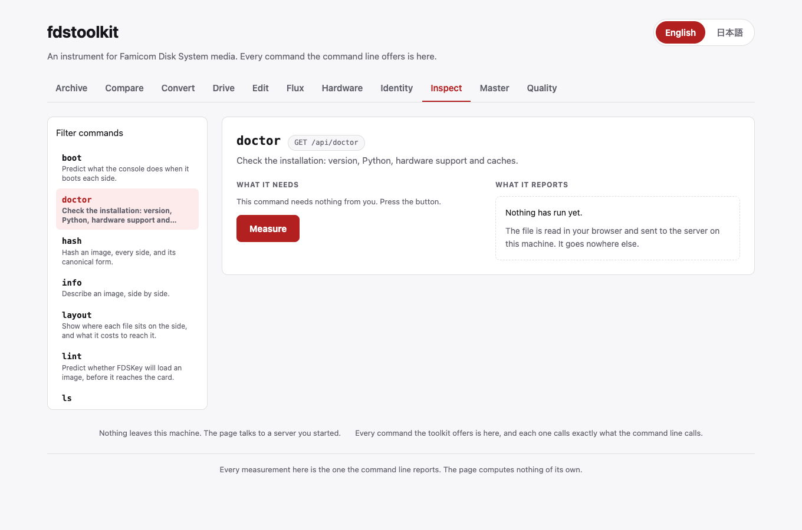
</picture>

#### `info`

```bash
fdstoolkit info <image> [--json]
```

Side count, game code, manufacturing and rewrite dates, Disk Writer serial, declared and actual file counts, hidden files, trailing data.

<picture>
<source media="(prefers-color-scheme: dark)" srcset="assets/screenshots/info-dark.png">

</picture>

#### `ls`

```bash
fdstoolkit ls <image> [--json]
```

Every file on every side: number, id, name, load address, kind, size, and whether it sits past the declared count.

<picture>
<source media="(prefers-color-scheme: dark)" srcset="assets/screenshots/ls-dark.png">
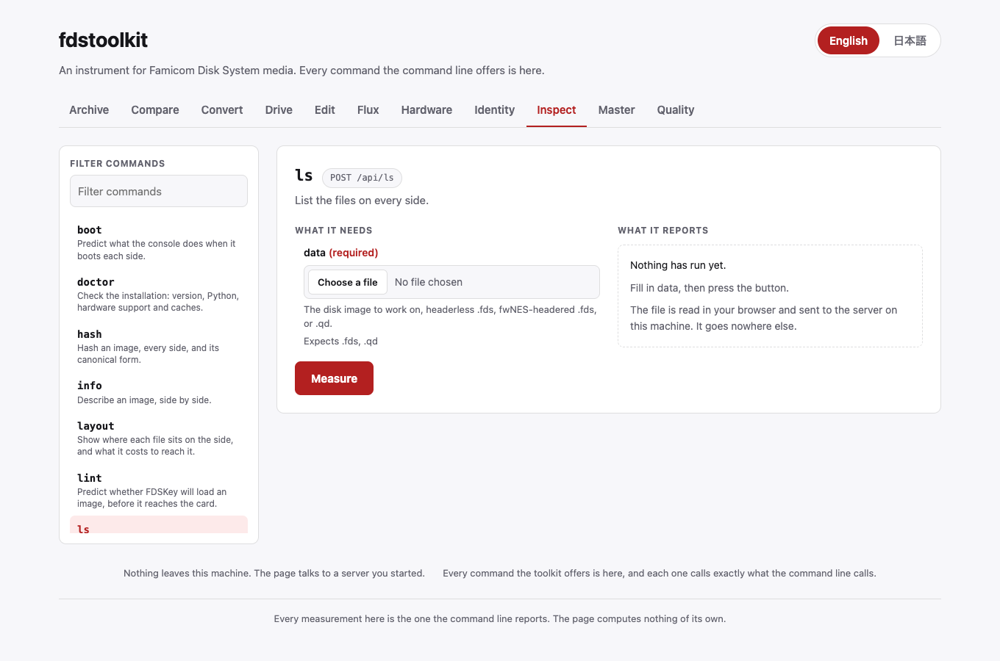
</picture>

#### `verify`

```bash
fdstoolkit verify <image> [--strict] [--json]
```

Structural and checksum findings, each with a code. `--strict` fails on warnings as well as errors.

<picture>
<source media="(prefers-color-scheme: dark)" srcset="assets/screenshots/verify-dark.png">

</picture>

#### `hash`

```bash
fdstoolkit hash <image> [--profile <name>] [--json]
```

CRC32, MD5, SHA-1 and SHA-256 of the whole image and of each side, plus the canonical digest and the RetroAchievements MD5.

<picture>
<source media="(prefers-color-scheme: dark)" srcset="assets/screenshots/hash-dark.png">

</picture>

#### `diff`

```bash
fdstoolkit diff <a> <b> [--explain] [--json]
```

Which blocks differ. `--explain` names the disk-info fields and the files instead of block indices.

<picture>
<source media="(prefers-color-scheme: dark)" srcset="assets/screenshots/diff-dark.png">

</picture>

#### `boot`

```bash
fdstoolkit boot <image> [--json]
```

What the BIOS does with each side: which file it loads, whether approval data is present, and the error number it would display.

<picture>
<source media="(prefers-color-scheme: dark)" srcset="assets/screenshots/boot-dark.png">

</picture>

#### `layout`

```bash
fdstoolkit layout <image> [--json]
```

Byte offset of each file along the spiral and the time the drive spends reaching it, at the nominal bit rate.

<picture>
<source media="(prefers-color-scheme: dark)" srcset="assets/screenshots/layout-dark.png">
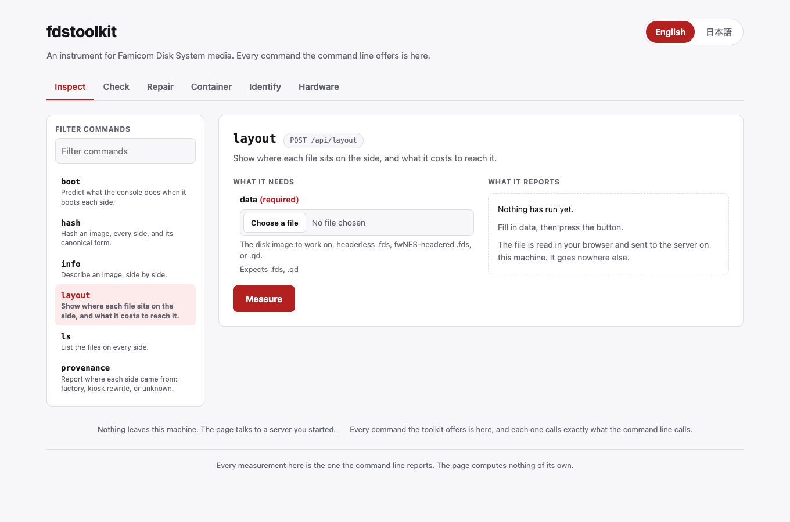
</picture>

#### `provenance`

```bash
fdstoolkit provenance <image> [--json]
```

Factory, kiosk rewrite, or unknown, per side, with the dates, serial and rewrite count behind the verdict. A factory disk carries serial `ffff` and rewrite count `00`.

<picture>
<source media="(prefers-color-scheme: dark)" srcset="assets/screenshots/provenance-dark.png">

</picture>

### Conversion and construction

#### `convert`

```bash
fdstoolkit convert <image> -o <out> [--header|--no-header] [--crc-mode preserve|compute|null] [--force]
```

Between `.fds` and `.qd`. `--crc-mode` decides what goes in the CRC fields when writing `.qd`: keep what the source had, recompute, or zero them. `preserve` is the default because a round trip that recomputes silently repairs corruption you may be trying to study.

<picture>
<source media="(prefers-color-scheme: dark)" srcset="assets/screenshots/convert-dark.png">

</picture>

#### `canon`

```bash
fdstoolkit canon <image> --profile <name> [-o <out>] [--force]
```

Print the canonical digest, and with `-o` write the canonical image.

<picture>
<source media="(prefers-color-scheme: dark)" srcset="assets/screenshots/canon-dark.png">
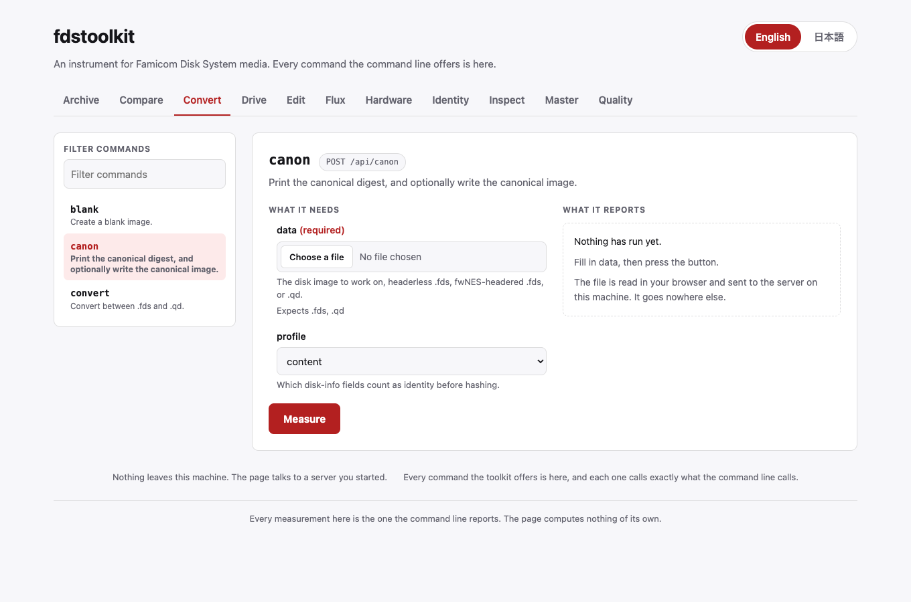
</picture>

#### `blank`

```bash
fdstoolkit blank -o <out> [--sides N] [--formatted] [--header] [--game-name ABC] [--force]
```

A blank image. `--formatted` writes a disk information block using values measured from 1,729 never-rewritten sides: country `49`, serial `ffff`, rewrite count `00`, filler `ff`.

<picture>
<source media="(prefers-color-scheme: dark)" srcset="assets/screenshots/blank-dark.png">

</picture>

#### `build`

```bash
fdstoolkit build <manifest> -o <out> [--force]
```

A disk built from a JSON manifest naming the disk fields and the files to place.

<picture>
<source media="(prefers-color-scheme: dark)" srcset="assets/screenshots/build-dark.png">

</picture>

#### `card`

```bash
fdstoolkit card -o <out> [--firmware <variant>] [--force]
```

A blank an FDSKey card accepts.

<picture>
<source media="(prefers-color-scheme: dark)" srcset="assets/screenshots/card-dark.png">
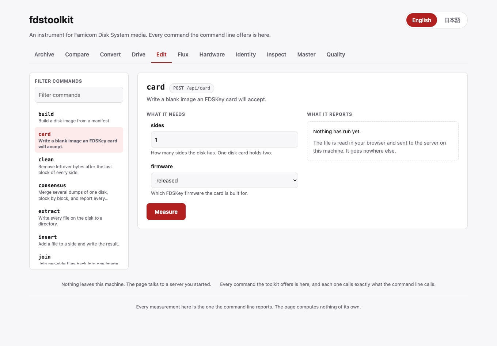
</picture>

#### `split` and `join`

```bash
fdstoolkit split <image> -d <dir> [--stem <s>] [--force]
fdstoolkit join <files>... -o <out> [--force]
```

One file per side in copier layout, and back. `--stem` sets the base name for the side files, defaulting to `fc1234`. `join` accepts the files in any order.

<picture>
<source media="(prefers-color-scheme: dark)" srcset="assets/screenshots/split-dark.png">
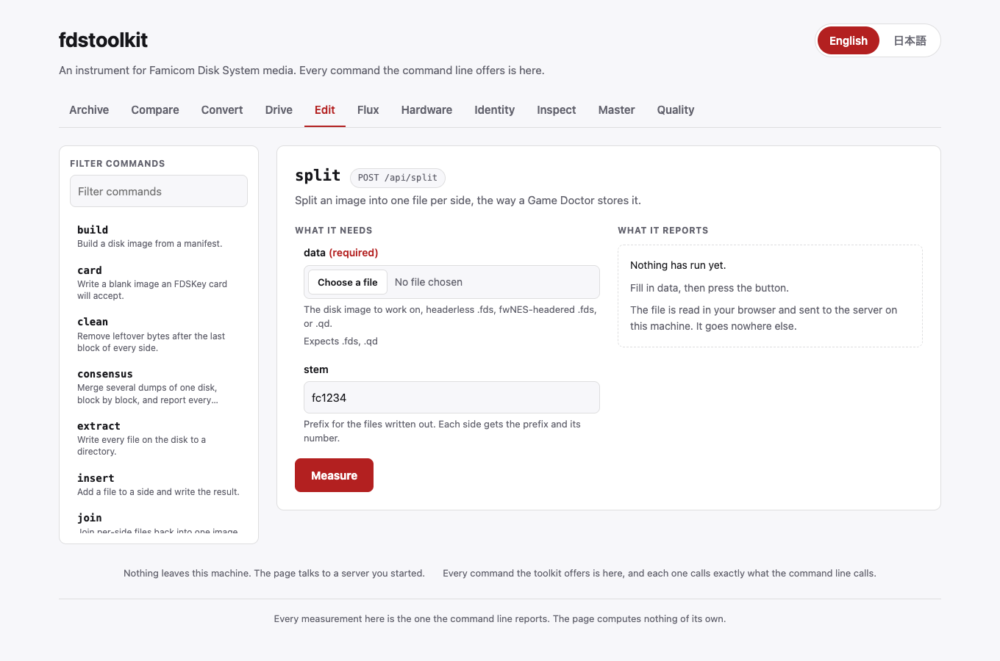
</picture>
<picture>
<source media="(prefers-color-scheme: dark)" srcset="assets/screenshots/join-dark.png">
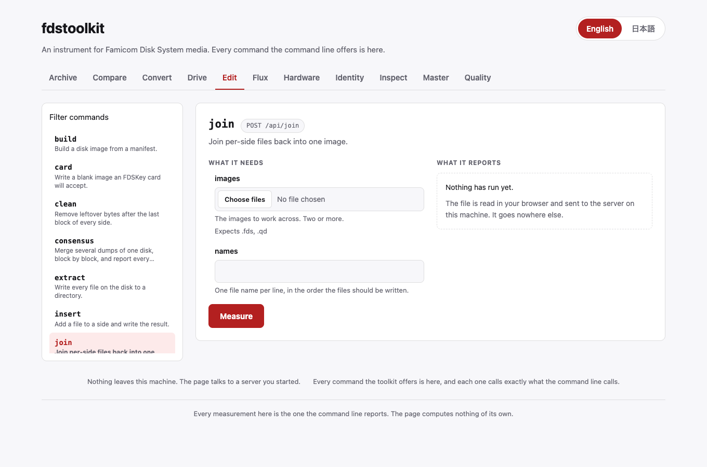
</picture>

#### `merge` and `unmerge`

```bash
fdstoolkit merge <disks>... -o <out> [--header|--no-header] [--force]
fdstoolkit unmerge <set> -d <dir> [--force]
```

The disks of a multi-disk game into one image, and back. Pass the disks in order. `--header` writes an fwNES header; the default is `--no-header`.

<picture>
<source media="(prefers-color-scheme: dark)" srcset="assets/screenshots/merge-dark.png">
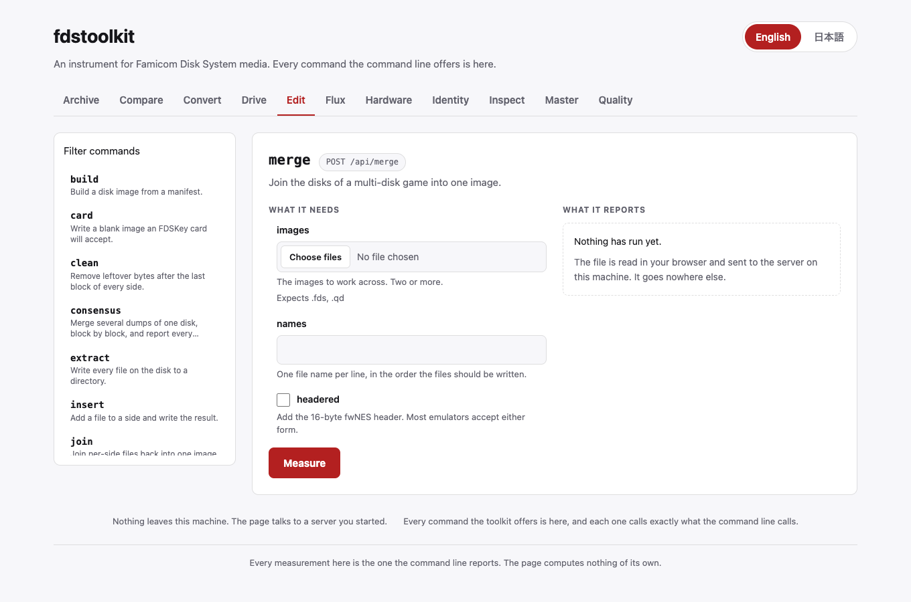
</picture>
<picture>
<source media="(prefers-color-scheme: dark)" srcset="assets/screenshots/unmerge-dark.png">
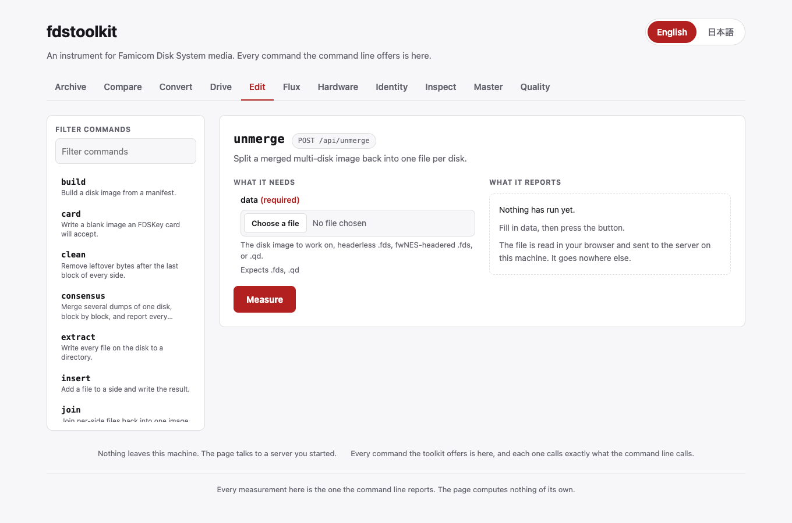
</picture>

#### `export`

```bash
fdstoolkit export <image> --target <t> -d <dir> [--bios <file>] [--force]
```

The directory layout a device or emulator expects. Targets: `nt-mini`, `mister`, `everdrive-n8-pro`, `mesen2`, `fceux`, `ares`. `--bios` also places the BIOS where that target looks for it.

<picture>
<source media="(prefers-color-scheme: dark)" srcset="assets/screenshots/export-dark.png">

</picture>

#### `import-ares`

```bash
fdstoolkit import-ares <files>... -o <out> [--force]
```

An image rebuilt from ares per-side files, including any save they carry.

<picture>
<source media="(prefers-color-scheme: dark)" srcset="assets/screenshots/import-ares-dark.png">
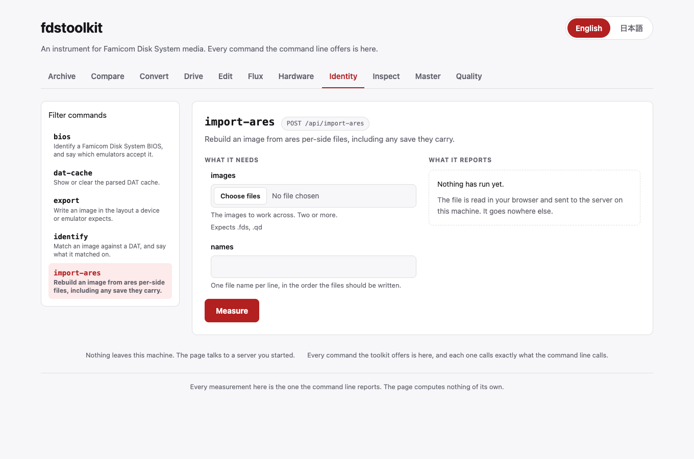
</picture>

### Editing and repair

#### `extract`

```bash
fdstoolkit extract <image> -d <dir> [--force]
```

Every file to disk, including files past the declared count.

<picture>
<source media="(prefers-color-scheme: dark)" srcset="assets/screenshots/extract-dark.png">

</picture>

#### `insert`

```bash
fdstoolkit insert <image> --file <f> --name <n> -o <out> [--address <hex>] [--kind program|character|nametable] [--side N] [--force]
```

Adds a file and raises the declared count. `--address` defaults to `6000`.

<picture>
<source media="(prefers-color-scheme: dark)" srcset="assets/screenshots/insert-dark.png">

</picture>

#### `set`

```bash
fdstoolkit set <image> --set field=value... -o <out> [--side N] [--force]
```

Change disk information fields. Repeatable. Field names are the ones `info --json` prints.

<picture>
<source media="(prefers-color-scheme: dark)" srcset="assets/screenshots/set-dark.png">

</picture>

#### `clean`

```bash
fdstoolkit clean <image> -o <out> [--force]
```

Remove non-zero bytes after the last block.

<picture>
<source media="(prefers-color-scheme: dark)" srcset="assets/screenshots/clean-dark.png">
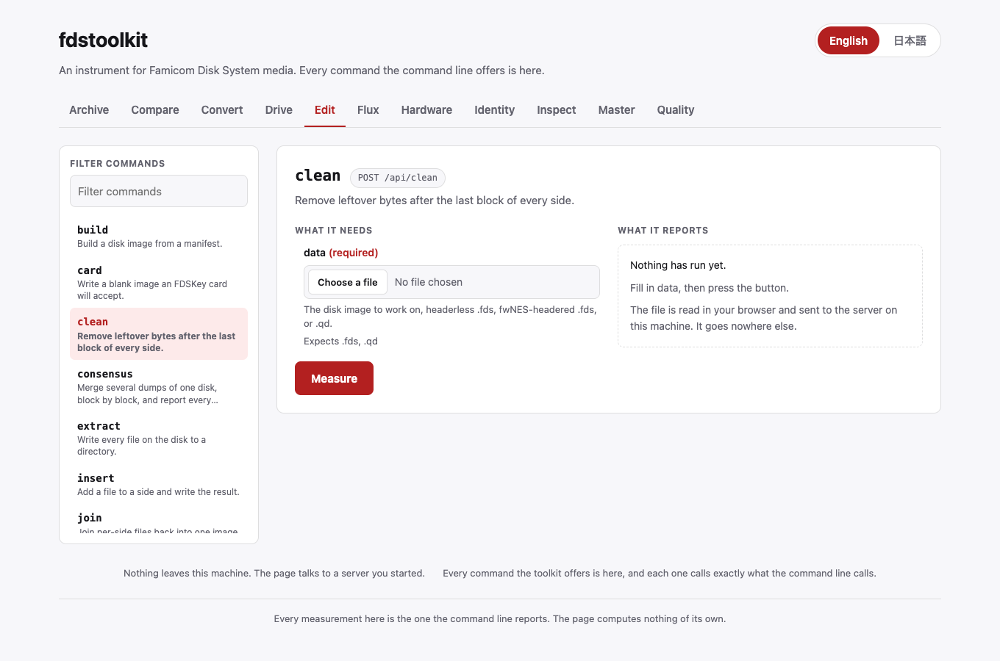
</picture>

#### `rebuild`

```bash
fdstoolkit rebuild <image> -o <out> [--keep-tail] [--reveal-hidden] [--drop-hidden] [--renumber] [--force]
```

Re-emit from the parsed model: recompute checksums, correct declared sizes, drop trailing data. Hidden files are kept by default; `--reveal-hidden` raises the declared count to match, `--drop-hidden` removes them.

<picture>
<source media="(prefers-color-scheme: dark)" srcset="assets/screenshots/rebuild-dark.png">

</picture>

#### `patch`

```bash
fdstoolkit patch <image> --patch <p> -o <out> [--force]
```

Apply IPS, UPS or BPS, whether the patch was made against the headered or headerless image.

<picture>
<source media="(prefers-color-scheme: dark)" srcset="assets/screenshots/patch-dark.png">

</picture>

#### `splice`

```bash
fdstoolkit splice <image> --donor <d>... -o <out> [--force]
```

Replace blocks whose CRC fails with the same block from a donor dump that has it good. Reports each substitution and every block no donor could supply. Exits 1 if anything is left unrepaired.

<picture>
<source media="(prefers-color-scheme: dark)" srcset="assets/screenshots/splice-dark.png">

</picture>

### Saves

#### `saves`

```bash
fdstoolkit saves <images>... [--json]
```

Compares dumps of one release and reports which file holds the save.

<picture>
<source media="(prefers-color-scheme: dark)" srcset="assets/screenshots/saves-dark.png">
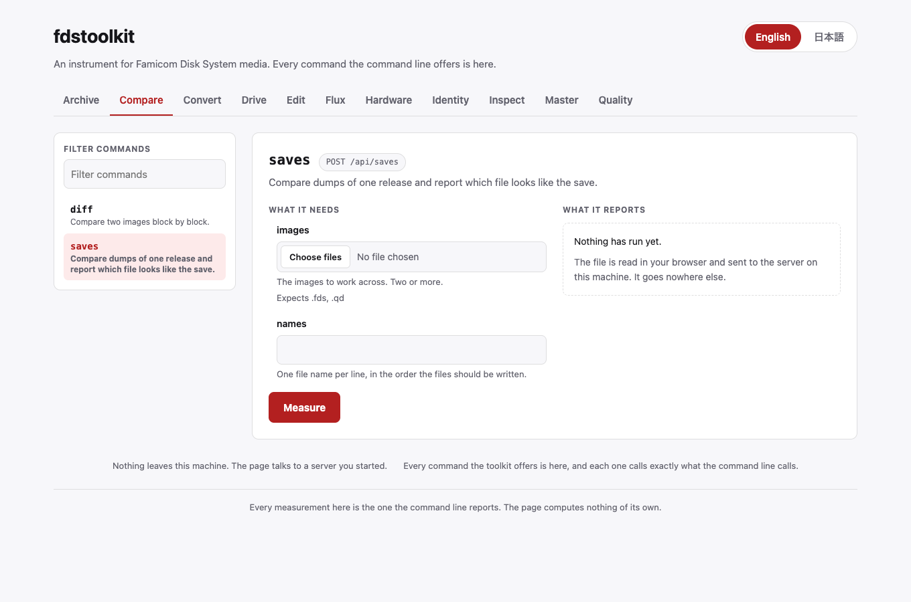
</picture>

#### `save-apply`

```bash
fdstoolkit save-apply <image> --save <s> -o <out> [--force]
```

Merge an IPS, UPS, BPS or whole-image save back in.

<picture>
<source media="(prefers-color-scheme: dark)" srcset="assets/screenshots/save-apply-dark.png">
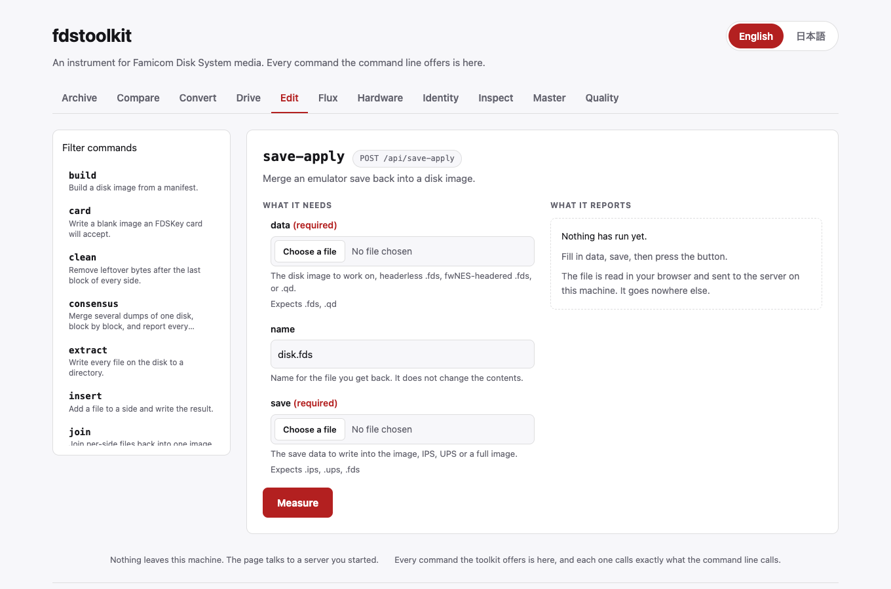
</picture>

#### `save-extract`

```bash
fdstoolkit save-extract <image> --played <p> -o <out> [--format ips|ups|image] [--force]
```

Write the difference between a pristine disk and a played one.

<picture>
<source media="(prefers-color-scheme: dark)" srcset="assets/screenshots/save-extract-dark.png">
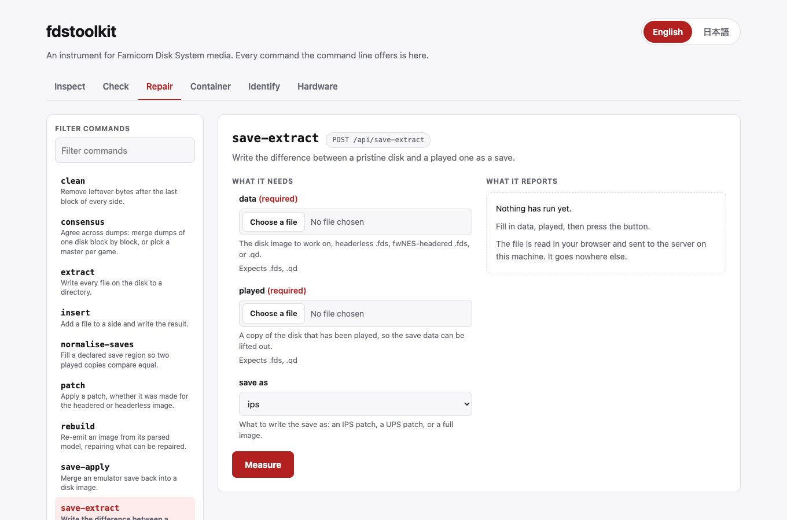
</picture>

#### `normalise-saves`

```bash
fdstoolkit normalise-saves <image> --recipes <r> -o <out> [--force]
```

Blank a declared save region so two played copies compare equal. `--recipes` names the file declaring which region is the save, and is required: the toolkit will not guess which bytes a game writes.

<picture>
<source media="(prefers-color-scheme: dark)" srcset="assets/screenshots/normalise-saves-dark.png">
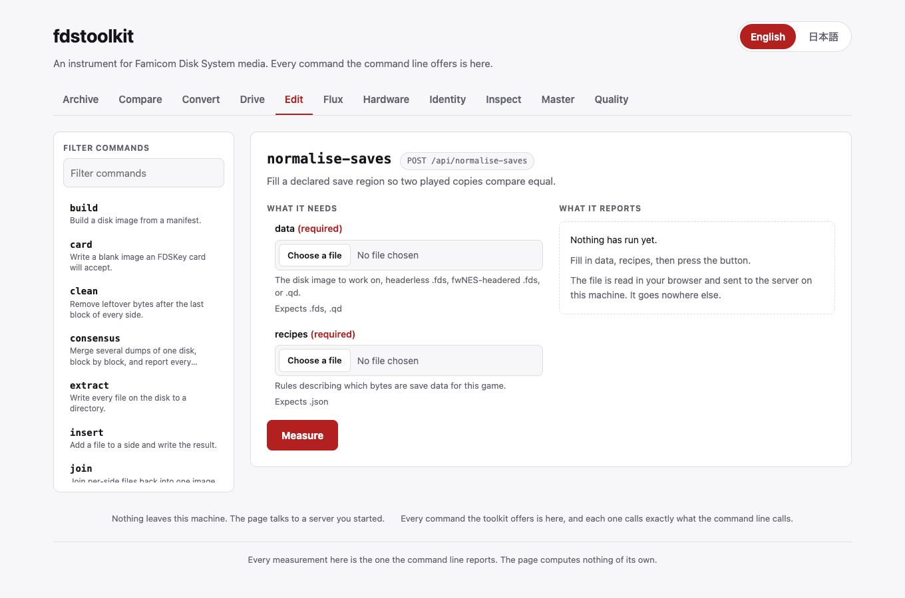
</picture>

### Identification

#### `identify`

```bash
fdstoolkit identify <image> --dat <file> [--reference <dir>] [--no-cache] [--json]
```

The matching DAT entry and which digest matched. With `--reference`, a miss reports the nearest image in that directory and the byte runs that differ.

<picture>
<source media="(prefers-color-scheme: dark)" srcset="assets/screenshots/identify-dark.png">
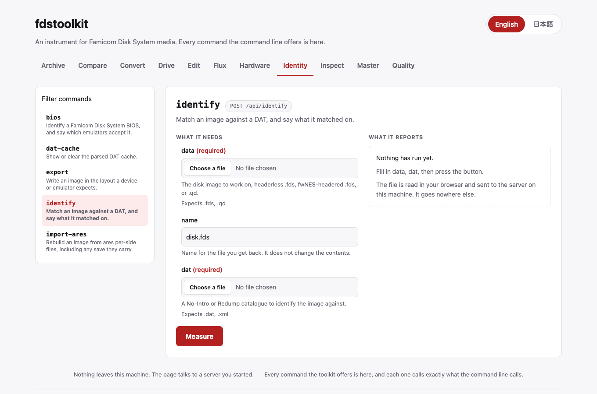
</picture>

#### `dat-cache`

```bash
fdstoolkit dat-cache [--clear]
```

Show or clear the parsed-DAT cache.

<picture>
<source media="(prefers-color-scheme: dark)" srcset="assets/screenshots/dat-cache-dark.png">
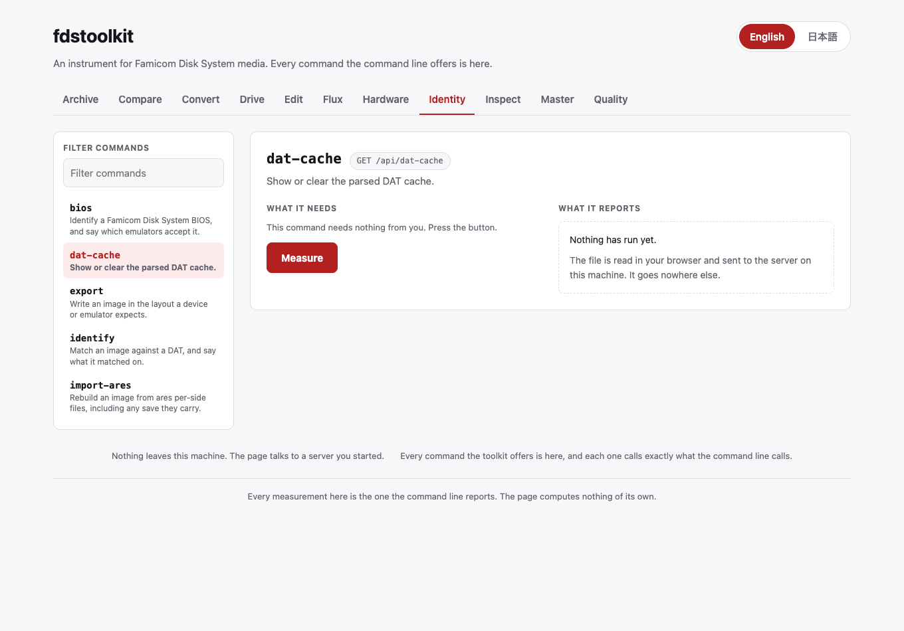
</picture>

#### `bios`

```bash
fdstoolkit bios <file> [--extract <out>] [--force]
```

BIOS revision and which emulators accept the file. `--extract` pulls the 8 KB image out of a larger dump.

<picture>
<source media="(prefers-color-scheme: dark)" srcset="assets/screenshots/bios-dark.png">
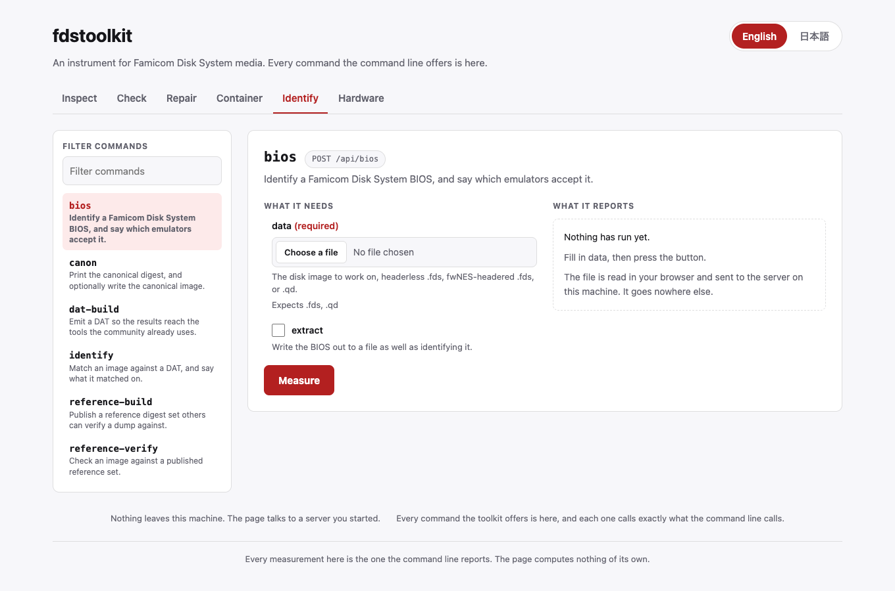
</picture>

#### `lint`

```bash
fdstoolkit lint <image> [--json]
```

Whether FDSKey will load the image, before it reaches the card.

<picture>
<source media="(prefers-color-scheme: dark)" srcset="assets/screenshots/lint-dark.png">
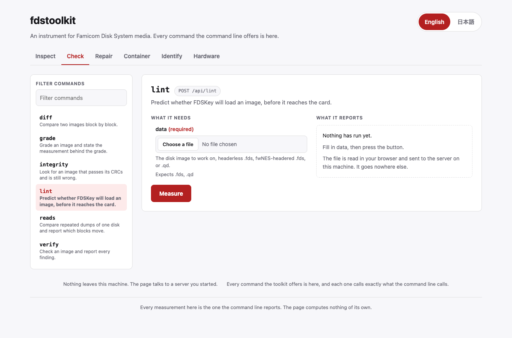
</picture>

### Quality measurement

A checksum answers one bit about a 65,500-byte side. These answer more.

#### `reads`

```bash
fdstoolkit reads <images>... [--json]
```

Compares repeated dumps of one physical disk block by block. Reports stability, which blocks move, and the direction of the bit flips. Magnetic decay loses transitions, so ones fall to zeros; the report names that as `loss`, the opposite as `gain`, and both as `mixed`.

```bash
fdstoolkit reads pass1.fds pass2.fds pass3.fds
```

```
passes        3
stability     99.88%
decay         loss
bits lost     14
bits gained   0
```

<picture>
<source media="(prefers-color-scheme: dark)" srcset="assets/screenshots/reads-dark.png">

</picture>

#### `calibrate`

```bash
fdstoolkit calibrate <reference> --read <r>... [--margin <f>] [--json]
```

The drive's own error rate, measured against a disk you trust, so the drive is not blamed for the disk or the reverse. Verdict is `good`, `marginal` or `faulty`.

<picture>
<source media="(prefers-color-scheme: dark)" srcset="assets/screenshots/calibrate-dark.png">

</picture>

#### `grade`

```bash
fdstoolkit grade <image> [--read <r>...] [--margin <f>] [--map] [--json]
```

A grade with the measurement behind it. `--read` folds in repeated dumps, `--margin` folds in a flux margin from `flux`, `--map` prints the per-block confidence and the basis for each.

```bash
fdstoolkit grade disk.fds --read pass2.fds --margin 0.68
```

```
clean, confidence 0.97
  ok   errors 0 within 0
  ok   confidence 0.97 within 0.6
  ok   read stability 1 within 1
```

Confidence starts from the checksum state and is adjusted by read agreement and flux margin. A container that stores no checksums is treated as unproven rather than suspect, which is why a headerless `.fds` does not grade as unstable.

<picture>
<source media="(prefers-color-scheme: dark)" srcset="assets/screenshots/grade-dark.png">

</picture>

#### `integrity`

```bash
fdstoolkit integrity <image> [--original-crcs] [--json]
```

Finds images that pass every checksum and are still wrong: a file body that is almost entirely undocumented opcodes, a body whose length disagrees with its header, and, with `--original-crcs`, a dump whose stored checksums all recompute exactly when they should not.

The opcode threshold is calibrated against 10,105 real program files, whose median is 36% undocumented opcodes because these files routinely carry graphics and tables. Only a file that is almost entirely non-code is reported. Names like `SAVEDATA` and `JMP-TBL.` surface that way and are working as intended.

<picture>
<source media="(prefers-color-scheme: dark)" srcset="assets/screenshots/integrity-dark.png">
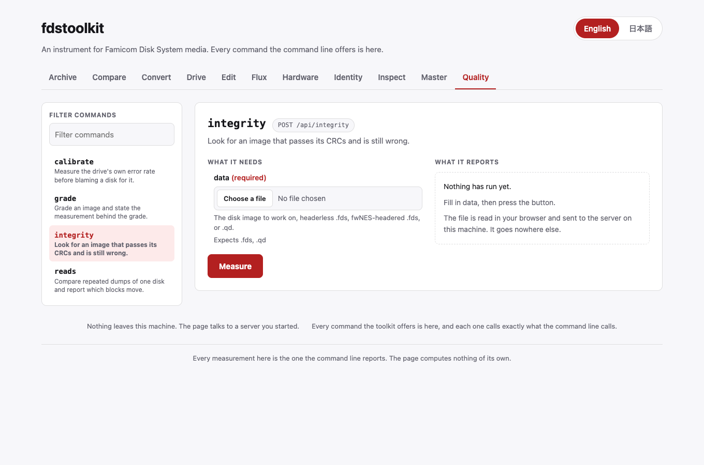
</picture>

### Flux captures

#### `flux`

```bash
fdstoolkit flux <capture> [--format <f>] [--json]
```

Measures a capture: fitted bit cell, cluster centres and jitter, separation margin, stray count, outliers, speed, and which tracks carry no coherent data.

```bash
fdstoolkit flux capture.scp
```

```
format        scp
track 0       32753 pulses, bit cell 2825 ns (354013 Hz)
  class 0     centre     2825 ns  jitter    109 ns  7926 pulses
  class 1     centre     5367 ns  jitter     61 ns  19002 pulses
  class 2     centre     8117 ns  jitter     35 ns  5825 pulses
  0 to 1     margin 89.8% at boundary 4096 ns
  1 to 2     margin 90.8% at boundary 6742 ns
  speed       349.52 rpm
worst margin  89.8% on track 0
verdict       healthy
```

Formats read: SuperCard Pro `.scp`, KryoFlux streams, HxC `.hfe`, and interval captures. Detected from the file; `--format` overrides with `scp`, `hfe`, `kryoflux`, `counts` or `raw03`.

Three things this does that a fixed-threshold reader does not:

- **The pulse family is fitted.** A Disk System or MFM stream runs on intervals of 1, 1.5 and 2 cells; a group-coded stream runs on 1, 2 and 3. Both are tried and the better fit kept, because assuming the wrong one makes clean media look broken.
- **Separation is measured at the first percentile**, not at the single closest pulse. Every real capture carries a few strays, and one of them should not decide the verdict. The stray count is reported separately.
- **Blank is distinguished from degraded.** A track whose relative cluster spread exceeds 15% carries no coherent data and is named blank rather than failing. Measured on a real image, formatted tracks sit at 1.1 to 2.9% and unformatted ones at 31.8 to 42.6%.

A revolution that does not span a full rotation is marked partial and left out of the speed figures.

<picture>
<source media="(prefers-color-scheme: dark)" srcset="assets/screenshots/flux-dark.png">
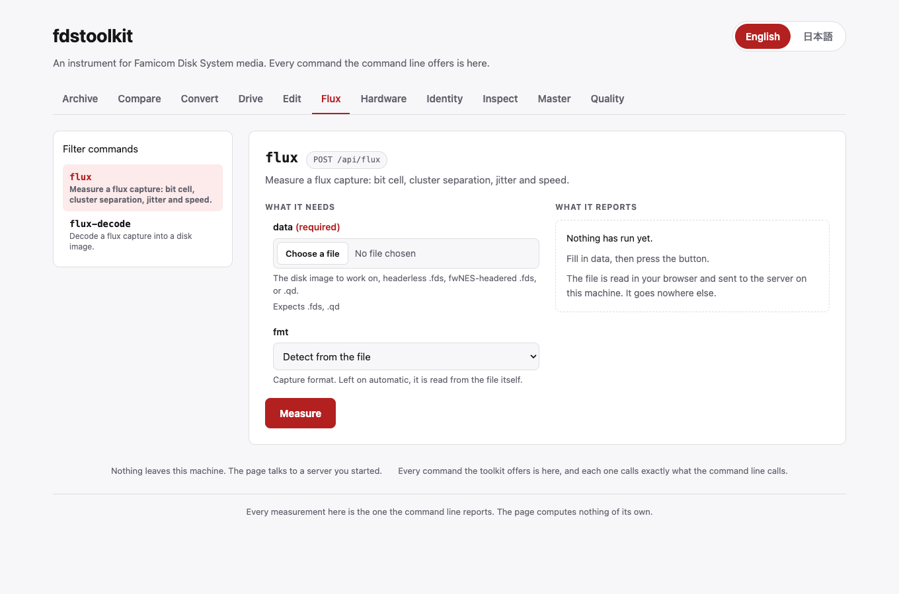
</picture>

#### `flux-decode`

```bash
fdstoolkit flux-decode <capture> -o <out> [--format <f>] [--fixed] [--force]
```

Decode a capture into a disk image. Thresholds are fitted to the capture, so a stream recorded well off nominal still decodes; `--fixed` uses nominal thresholds instead.

<picture>
<source media="(prefers-color-scheme: dark)" srcset="assets/screenshots/flux-decode-dark.png">
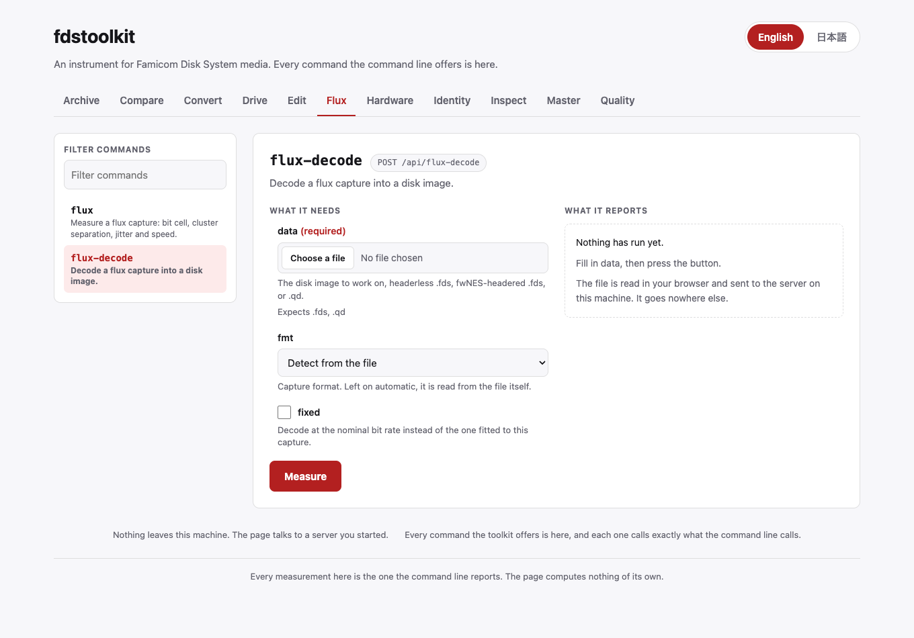
</picture>

#### `classes`

```bash
fdstoolkit classes <capture> [--format <f>] [--json]
```

For captures that carry pulse classes rather than timing. Reports the distribution across the three lengths and the count of pulses that fell outside all of them.

Gap runs are excluded before measuring, because a gap is a long run of short pulses and leaving it in makes the distribution a measure of how full the disk is rather than of how the drive reads. Over the remainder, 120 real sides give a median of 63.1, 27.9 and 9.0 percent, which is the reference used here. On a perfect drive those 120 sides spread from -5.4 to +3.0 percent, so the threshold sits at 6 percent and none of them trip it.

Two limits worth knowing. A capture with fewer than 512 pulses outside the gaps is reported as sparse rather than judged. And the invalid-pulse count is the only figure here that is independent of what is on the disk, so it is the one to trust when the two disagree.

<picture>
<source media="(prefers-color-scheme: dark)" srcset="assets/screenshots/classes-dark.png">
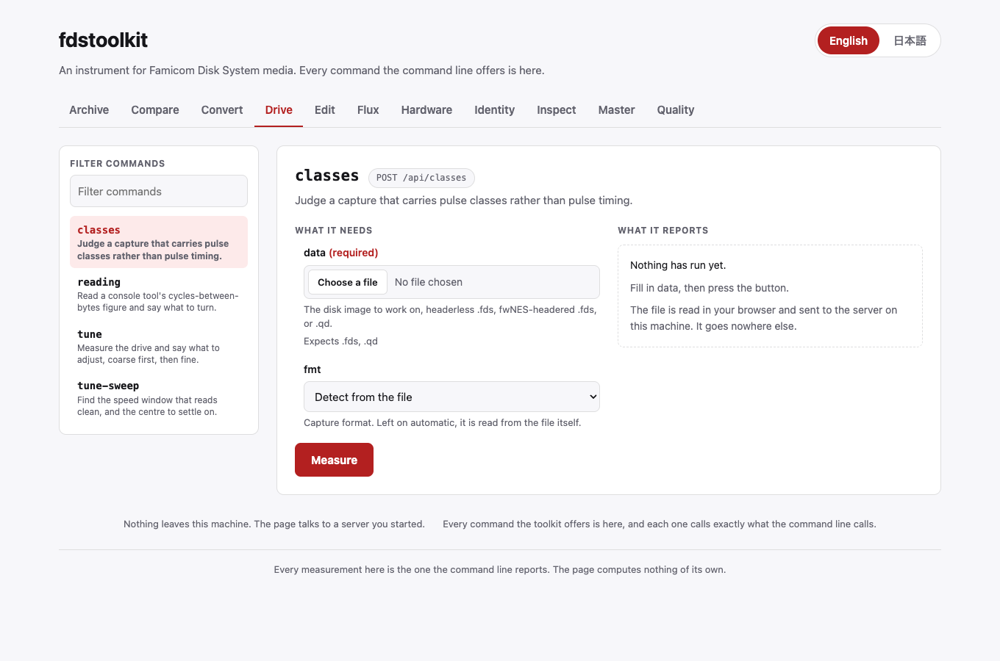
</picture>

### Drive calibration

Everything here is measured against the bit rate, never a rotation speed. The RAM adapter expects 96.4 kbit/s and tolerates ten percent, and that is the only figure the hardware enforces. Published rotation speeds for this mechanism disagree by a factor of two and carry no tolerance.

#### `reading`

```bash
fdstoolkit reading <cycles> [--json]
```

Interprets the average CPU cycles between bytes that a disk-lister tool displays on the console. This is the only speed measurement that needs no capture hardware.

```bash
fdstoolkit reading 152
```

```
94.20 kbit/s, cell 10616 ns (63.7 counts), -2.28% of nominal, in spec, run faster
turn the motor trimmer counter-clockwise to run faster
```

The conversion is exact: the 2A03 runs at 1.7897725 MHz over eight bits, so cycles map to a rate directly. More cycles between bytes means a slower disk.

| Reading | Rate | Error |
|---|---|---|
| 146 | 98.07 kbit/s | +1.73% |
| 148 | 96.74 kbit/s | +0.36% |
| 149 | 96.10 kbit/s | -0.32% |
| 152 | 94.20 kbit/s | -2.28% |

Exact nominal is 148.53 cycles, so the integer display quantises at about 0.68% per count.

<picture>
<source media="(prefers-color-scheme: dark)" srcset="assets/screenshots/reading-dark.png">
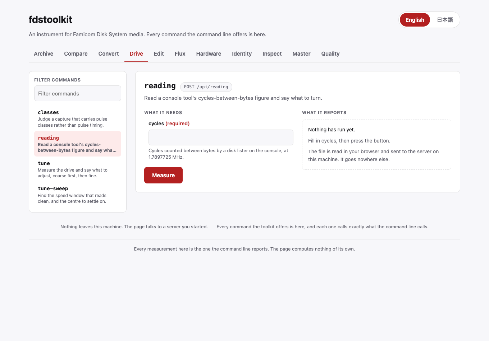
</picture>

#### `tune`

```bash
fdstoolkit tune <capture> [--format <f>] [--json]
```

Measures a timing capture and reports what to adjust in two stages.

```bash
fdstoolkit tune slow.raw
```

```
81.79 kbit/s, cell 12226 ns (73.4 counts), -15.15% of nominal, out of spec, run faster
periodic, wow and flutter 3.42%, drift +0.26%, spread 9.69%
score 6%
  [coarse] motor speed: -15.15% of nominal, outside the band the adapter tolerates.
           turn the motor trimmer counter-clockwise to run faster, then measure again
  [coarse] belt and spindle: wow and flutter 3.42%, spread 9.69%.
           replace or reseat the belt and check the spindle runs true, then measure again
```

| Stage | Band | Meaning |
|---|---|---|
| coarse | outside ±10% | the adapter will refuse the disk |
| fine | outside ±1% | reads, and is not set up |
| settled | within ±1%, wow under 0.2% | nothing left to adjust |

Speed alone cannot separate a stretched belt from a misadjusted trimmer, so cell length is tracked across the capture. A drive that wanders reads as `periodic`, one that walks in one direction as `drifting`, one that holds as `steady`.

Measurement resolution is 0.001% of the cell, from an analytic least-squares solve after a coarse-to-fine scan.

<picture>
<source media="(prefers-color-scheme: dark)" srcset="assets/screenshots/tune-dark.png">
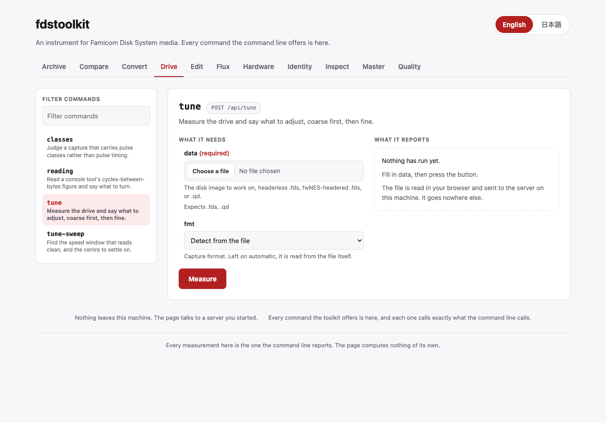
</picture>

#### `tune-sweep`

```bash
fdstoolkit tune-sweep <captures>... [--format <f>] [--json]
```

One capture per trimmer position, in any order. Finds the full range of speeds that read clean and reports the centre to settle on, plus the width of that window as a health figure. A healthy drive reads across a wide span; a tired one only at a point.

Set the trimmer to the centre of the window rather than to the first position that works.

<picture>
<source media="(prefers-color-scheme: dark)" srcset="assets/screenshots/tune-sweep-dark.png">
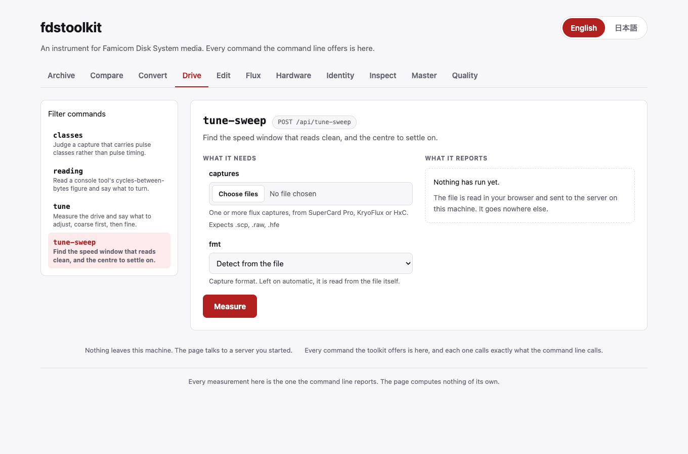
</picture>

### Masters and reference sets

No Nintendo master image exists. Disks were sold blank and written at a kiosk that stamped each one, so two copies of a game differ in bytes. The closest thing to a master is what every surviving dump agrees on once that stamp is set aside.

#### `masters`

```bash
fdstoolkit masters <corpus> [--profile <name>] [--json]
```

One master per game by agreement across every dump in a directory. Reports the dissenters rather than hiding them.

```bash
fdstoolkit masters ~/dumps
```

```
profile       release
dumps         595
games         242
unanimous     210 of 242
```

<picture>
<source media="(prefers-color-scheme: dark)" srcset="assets/screenshots/masters-dark.png">
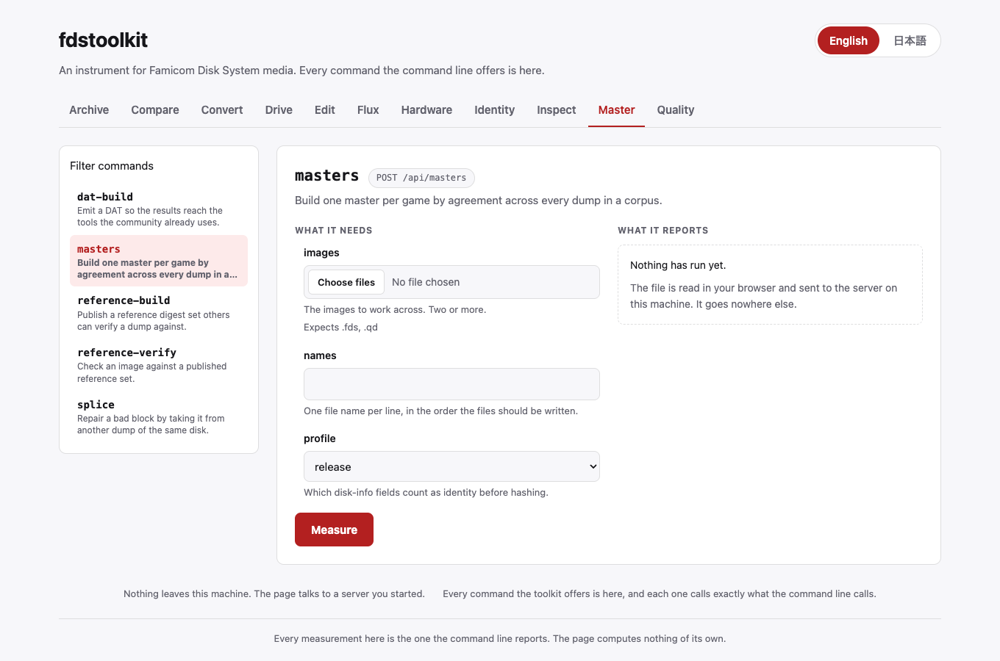
</picture>

#### `reference-build`

```bash
fdstoolkit reference-build <corpus> -o <set> --set-version <v> [--profile <name>] [--force]
```

Publish the result as a digest set anyone can verify against without installing anything.

<picture>
<source media="(prefers-color-scheme: dark)" srcset="assets/screenshots/reference-build-dark.png">
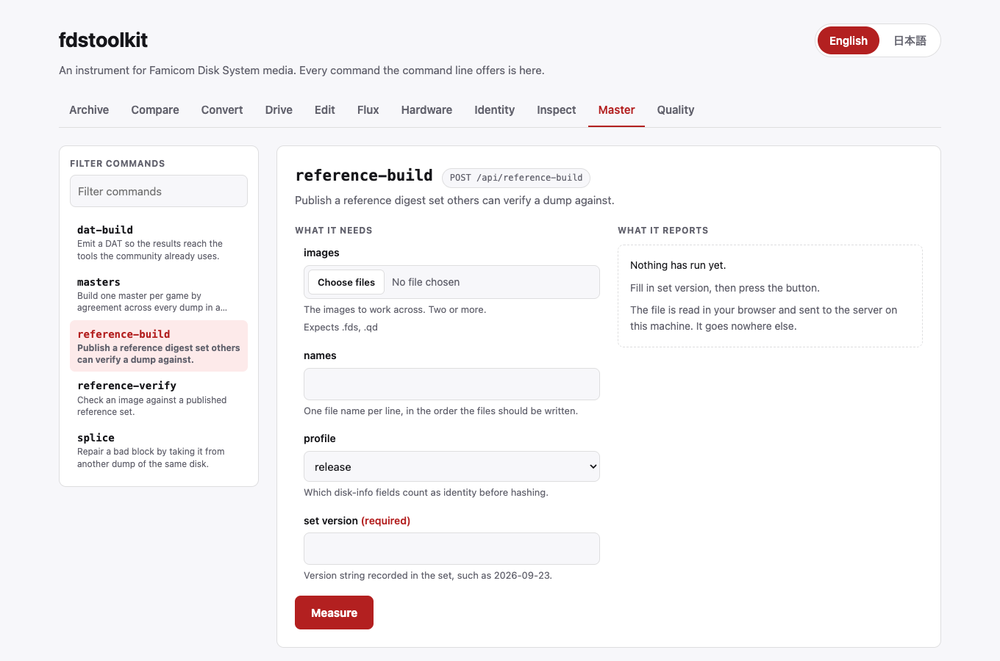
</picture>

#### `reference-verify`

```bash
fdstoolkit reference-verify <image> --set <set> [--json]
```

`match`, `mismatch` with the expected digest, or `unknown`.

<picture>
<source media="(prefers-color-scheme: dark)" srcset="assets/screenshots/reference-verify-dark.png">
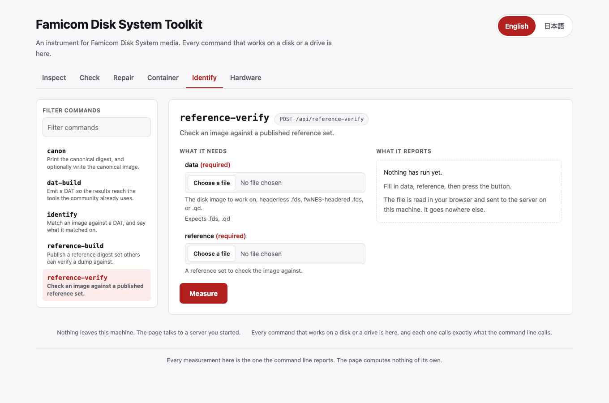
</picture>

#### `dat-build`

```bash
fdstoolkit dat-build <corpus> -o <out> --name <n> --set-version <v> [--author <a>] [--force]
```

A Logiqx DAT, so the results reach the tools the community already uses.

<picture>
<source media="(prefers-color-scheme: dark)" srcset="assets/screenshots/dat-build-dark.png">
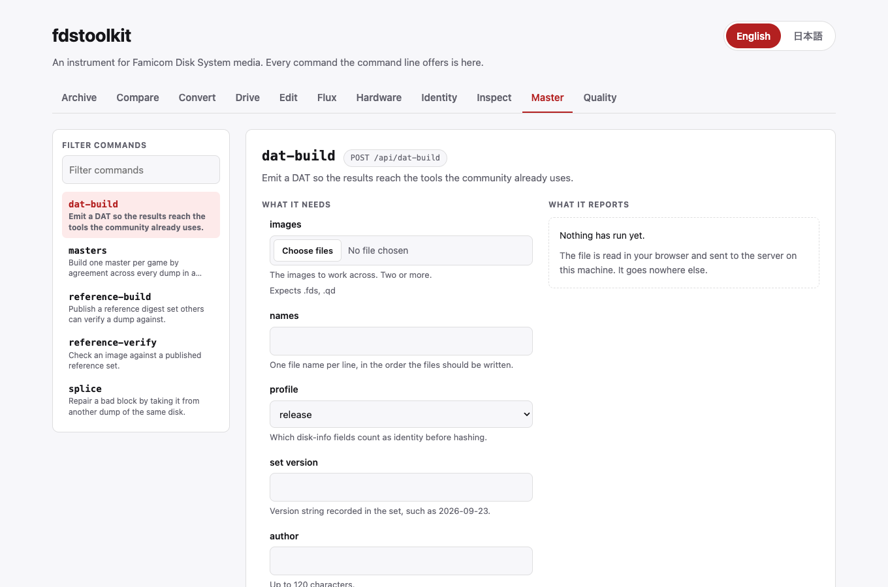
</picture>

#### `consensus`

```bash
fdstoolkit consensus <images>... -o <out> [--map] [--force]
```

Merge several dumps of one disk block by block by majority, and report every disagreement. `--map` prints per-block agreement.

<picture>
<source media="(prefers-color-scheme: dark)" srcset="assets/screenshots/consensus-dark.png">

</picture>

### Longitudinal tracking

#### `archive-add`

```bash
fdstoolkit archive-add <image> [--db <p>] [--taken <date>] [--drive <s>] [--notes <s>] [--bad-blocks <n>]
```

Record a dump against the physical disk it came from. Identity is derived from what the kiosk stamped, so two copies of one game are tracked apart.

<picture>
<source media="(prefers-color-scheme: dark)" srcset="assets/screenshots/archive-add-dark.png">
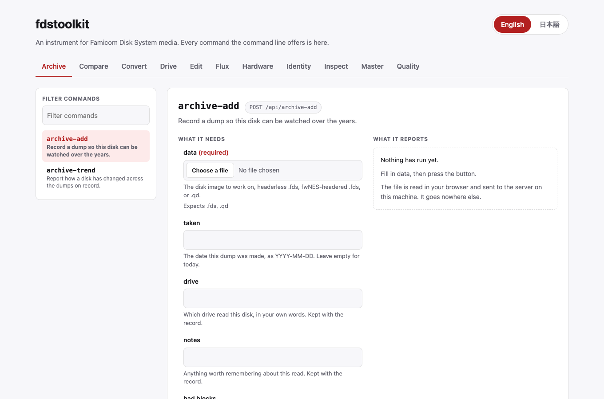
</picture>

#### `archive-trend`

```bash
fdstoolkit archive-trend [--db <p>] [--disk <id>] [--json]
```

Whether a disk is holding, degrading or reading better, how fast, and roughly how long it has left.

```bash
fdstoolkit archive-trend
```

```
4f2a...c19b: degrading, +10.0 blocks a year, unreadable in about 8 years
```

<picture>
<source media="(prefers-color-scheme: dark)" srcset="assets/screenshots/archive-trend-dark.png">
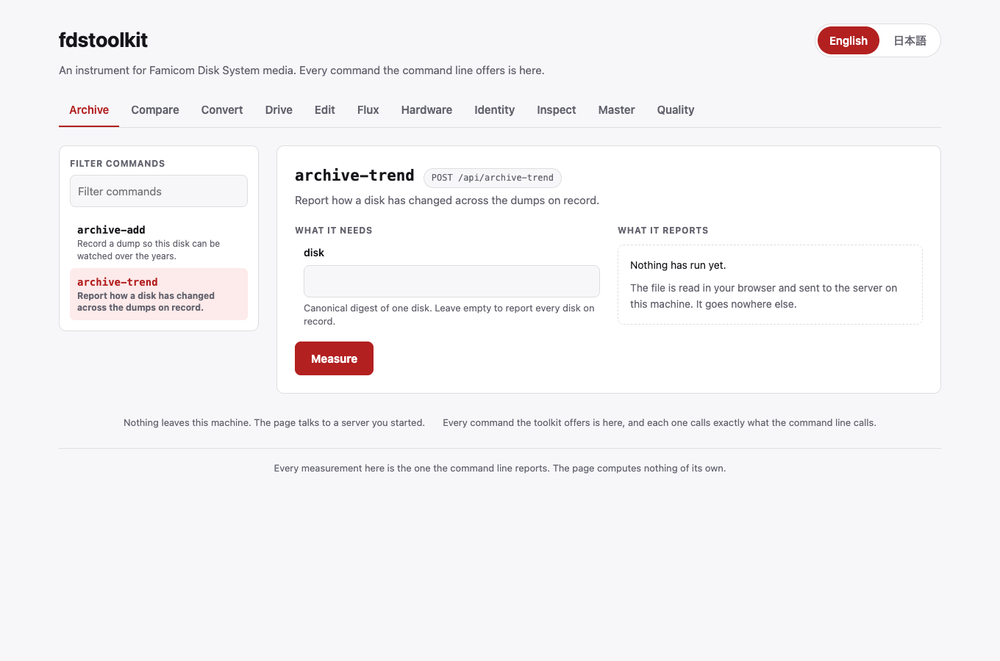
</picture>

### Hardware

#### `dump`

```bash
fdstoolkit dump -o <out> [--backend simulation|fdsstick|dumper] [--source ] [--sides N] [--passes N] [--retries N] [--raw <dir>] [--log <file>] [--yes] [--force]
```

Read a disk. `--passes` reads each side more than once, `--retries` sets per-block retries, `--raw` keeps every pulse capture the drive returned, `--log` writes a record of how the dump was taken.

A drive that reaches one face at a time cannot select a side. On those backends, reading more than one side asks you to turn the disk over between reads, and refuses rather than reading the same face twice. `--yes` answers that prompt. If the second read returns the same bytes as the first, the dump fails and writes nothing, because a disk that was not turned over produces a file that looks like a two-side dump and is not.

<picture>
<source media="(prefers-color-scheme: dark)" srcset="assets/screenshots/dump-dark.png">

</picture>

#### `submit`

```bash
fdstoolkit submit <image> --log <file> --dumper <name> [--affiliation <a>] [--photo <p>...] [--also <f>...] [-o <out>] [--force]
```

Assemble the submission a preservation project asks for.

The published dumping guide states that FDS verification is difficult because hashes never match, since the header carries the rewrite date. That is true of SHA-256 and it is why this command prints an identity digest beside the hashes: under the `release` profile the rewrite date, the kiosk serial and the rewrite count are masked, and 142 of 144 corpus groups then agree. The submission carries both, so a reader who wants the byte-exact hash has it and a reader who wants to compare copies has that too.

Every element the guide requires is present: size, CRC32, MD5, SHA-1 and SHA-256 per file, the tool with its hardware and firmware, the date, the dump log, and the non-default settings the dump ran with. `--also` hashes a second file into the same submission, which is how the RAW capture goes in beside the FDS. `--photo` cites a photograph you took.

What the toolkit cannot produce is listed rather than omitted. Photographs of the packaging, the media and the PCB are required by the guide and no program can supply them, so the command exits 1 until they are cited.

A log from a simulated drive is refused. A submission describes a physical disk, and a simulated dump describes none.

```bash
fdstoolkit dump -o disk.fds --backend fdsstick --sides 2 --raw captures/ --log disk.log.json
fdstoolkit submit disk.fds --log disk.log.json --dumper "your name" \
    --also captures/disk.read01.raw03 --photo media.jpg --photo pcb.jpg
```

<picture>
<source media="(prefers-color-scheme: dark)" srcset="assets/screenshots/submit-dark.png">
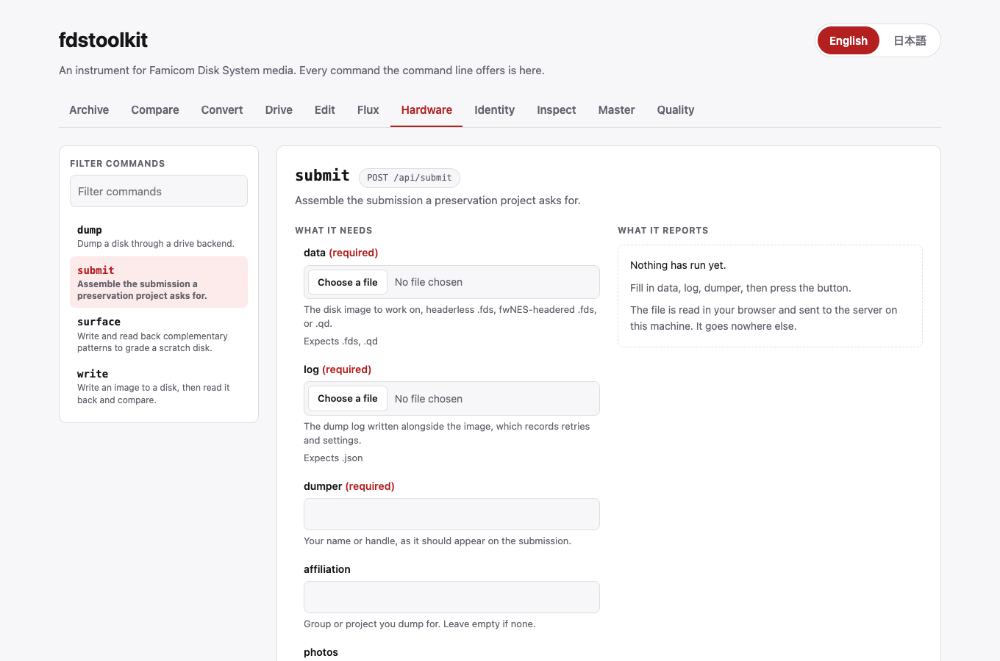
</picture>

#### `write`

```bash
fdstoolkit write <image> [--backend <b>] [--source ] [--backup <p>] [--retries N] [--assume-writable] [--yes]
```

Write a disk, read it back and compare. `--backup` saves the current contents first. Prompts unless `--yes`.

An FDSStick does not report whether a disk is write protected, whether the battery holds, or whether a disk is even present. Rather than assume those are fine, the toolkit reports them as unknown and refuses a destructive write. `--assume-writable` proceeds anyway. A state the drive reports as bad is still refused, so the override clears uncertainty, never a known fault.

<picture>
<source media="(prefers-color-scheme: dark)" srcset="assets/screenshots/write-dark.png">

</picture>

#### `surface`

```bash
fdstoolkit surface [--backend <b>] [--source ] [--sides N] [--passes N] [--quick] [--finish leave|blank|erase] [--backup <p>] [--yes]
```

Write and read back complementary patterns to grade a scratch disk. This is the magnetic
equivalent of a multi-pass `dd` wipe: it forces every bit cell to flip in both directions and
verifies what came back.

One pass writes four patterns in sequence, `0x00`, `0xFF`, `0xAA`, `0x55`. The first two drive
every cell to each saturation state, which is what exposes a weak cell that holds one polarity
and not the other. The second two alternate at the bit level, which exposes adjacent-cell
interference that a solid pattern cannot reach. Each pattern is read back and compared before the
next is written.

By default the side is filled to the physical limit of the track, 32 blocks and 59,145 data bytes
against the 66,560-byte gapped buffer. The remainder is inter-block gap, which the drive rewrites
on every pass anyway, so the whole surface is swept. `--quick` writes a single 4 KiB file instead,
covering 12% of the track, for a fast check rather than a verdict.

`--passes N` repeats the whole four-pattern cycle. More passes is how a marginal cell is
separated from a dead one, because a dead cell fails every time and a marginal one does not.

The report classifies each failing block by how often it failed:

| Class | Meaning |
|---|---|
| hard | Failed on more than one pattern. The surface itself is gone at that spot |
| transient | Failed exactly once. Marginal rather than dead |
| recovered | Failed on an early pass and read clean on every later one. The rewrite reflowed the magnetisation |

The recovered count is the repair case. Rewriting a cell that had drifted toward the threshold
restores its margin, and a disk that starts with failures and ends clean has been refreshed rather
than merely measured. It is not a substitute for a dump: back the disk up with `--backup` first,
because every pass destroys what was there.

`--finish` decides what the disk is left holding when the test ends.

| Value | Leaves |
|---|---|
| `leave` | The last pattern written, `0x55`. The default |
| `blank` | A factory-blank side: disk info block plus a file count of zero, byte-identical to what a kiosk-bought unwritten disk carries |
| `erase` | No blocks at all, so the adapter finds nothing to read |

`blank` is the useful one after a wipe. It produces the same bytes as
`blank --formatted`, which means the disk goes back into the drawer in the state it shipped in
and a writer will treat it as unwritten media.

`--backend simulation` stands in for hardware and takes `--source` to name the image it holds.

```bash
fdstoolkit surface --backend fdsstick --sides 2 --passes 3 \
    --backup before.fds --finish blank --yes
```

```
59145 data bytes per side, 100.0% of the physical track, 3 pass(es) of 4 patterns
pass 1 pattern 0x00: held
...
2 block(s) failed once, marginal rather than dead
2 block(s) failed early and read clean after, so rewriting refreshed them
left the disk formatted as it leaves the kiosk, verified
grade clean
```

Exit status is 0 only when every pattern held and the finish verified.

<picture>
<source media="(prefers-color-scheme: dark)" srcset="assets/screenshots/surface-dark.png">

</picture>

#### `web`

```bash
fdstoolkit web [--host <h>] [--port N] [--no-open]
```

Open the local web interface. Every command above is reachable from it, and each route calls exactly what the command calls. `--no-open` starts the server without opening a browser, which is what you want over SSH. Binds `127.0.0.1:8000` by default.

## Web interface

```bash
fdstoolkit web
```

`web` opens a browser on the page. `fdstoolkit web --no-open` starts the server without one, which is what you want over SSH. There is no headless-only command, because the toolkit drives hardware attached to this machine and is never a public service.

The page binds `127.0.0.1:8000` by default. It is not a service: nothing listens on a public interface unless you pass `--host`, and the page loads no remote resource, so no byte leaves the machine.

The rule the design turns on is that the web layer decides nothing. Every route parses its payload, calls the same function the command calls, and reports what came back. A grade requested through the page carries the same confidence and the same basis as `grade` prints, because it is the same call. That is checked rather than asserted: the tests compare a route's answer against the command's answer for the same input.

| Route | Command it mirrors |
|---|---|
| `GET /api/catalogue` | the profile, format and target tables |
| `GET /api/doctor` | `doctor` |
| `POST /api/info` | `info` and `ls` |
| `POST /api/verify` | `verify` |
| `POST /api/hash` | `hash` |
| `POST /api/grade` | `grade` |
| `POST /api/reads` | `reads` |
| `POST /api/flux` | `flux` |
| `POST /api/tune` | `tune` |
| `POST /api/reading` | `reading` |
| `POST /api/classes` | `classes` |
| `POST /api/blank` | `blank` |
| `POST /api/canon` | `canon` |
| `POST /api/convert` | `convert` |

Images and captures travel base64 encoded in the request body. `GET /docs` serves the generated API reference, so the page is one client of the endpoints rather than the only one.

The choices the page offers come from `catalogue`, which is built over the enums. A profile or capture format added to the model appears in the page with no second edit.

Nothing that writes to a disk is exposed. `dump`, `write` and `surface` stay on the command line, where the operator is in front of the drive and can answer a confirmation.

The interface is in English and Japanese. Both dictionaries carry the same keys, and the test suite proves it rather than trusting it: every key the markup or the script references must exist in both, and no Japanese string may be left as English.

## Procedures

### Preserving a disk

One dump says what the drive read once. Two say whether it read the same thing twice.

```bash
fdstoolkit dump -o pass1.fds --backend fdsstick --raw captures/
fdstoolkit dump -o pass2.fds --backend fdsstick
fdstoolkit reads pass1.fds pass2.fds
fdstoolkit grade pass1.fds --read pass2.fds
fdstoolkit archive-add pass1.fds --drive AN-500B
```

If the two disagree, `consensus` merges them by majority and names every block that did not settle. If one dump has a block another has good, `splice` takes it.

### Calibrating a drive, coarse then fine

1. Clean the head before anything else. Contamination reads as a media fault.
2. Run a disk-lister tool on the console, read the cycles figure, and pass it to `reading`. Turn the trimmer as instructed and repeat until it says to hold.
3. For the fine pass, capture at several trimmer positions and run `tune-sweep`. Settle at the centre of the clean window, not at the first position that reads.
4. Confirm with a disk known to be hard to read. Community practice uses a specific side with 39 files; pass means all 39 with no checksum error.

If `tune` reports `periodic` or `drifting` rather than `steady`, no trimmer position will fix it. That is the belt or the spindle.

### Deciding whether it is the drive or the disk

One disk cannot answer this. Read several and compare where they failed: a place that fails on every disk is the drive, failures confined to one disk are that disk, and a drive that stops answering is neither. In the last case the correct response is to stop, not to try another disk in it.

### Building a reference set

```bash
fdstoolkit masters ~/dumps
fdstoolkit reference-build ~/dumps -o fds-reference.json --set-version 2026-09-22
fdstoolkit reference-verify mine.fds --set fds-reference.json
```

## Formats

A side is a sequence of blocks:

| Block | Code | Length | Contents |
|---|---|---|---|
| Disk information | `0x01` | 56 | Verification string, game code, dates, kiosk provenance |
| File amount | `0x02` | 2 | Declared file count |
| File header | `0x03` | 16 | Number, id, name, load address, size, kind |
| File data | `0x04` | 1 + size | The file |

| Container | Side size | Checksums | Notes |
|---|---|---|---|
| `.fds` headerless | 65500 | No | What No-Intro hashes |
| `.fds` with fwNES header | 16 + 65500 per side | No | Header carries the side count |
| `.qd` | 65536 | Yes | Virtual Console rips and Quick Disk dumps |
| FDSKey card file | 65500 | No | Headerless within the firmware limits |
| Copier per-side files | one per side | Depends | A side may exceed the nominal length |
| ares side files | 73728 | Yes | Gaps and sync marks included |
| SuperCard Pro `.scp` | variable | Yes | Flux intervals, 25 ns resolution |
| KryoFlux stream | variable | Yes | Flux intervals, index blocks split revolutions |
| HxC `.hfe` | variable | Yes | Bitcells rather than intervals |
| Interval counts | variable | Yes | One byte per pulse interval |
| Packed pulse classes | variable | Yes | Two bits per pulse, already quantised |

What each conversion costs:

| From | To | Lost |
|---|---|---|
| `.fds` headered | `.fds` headerless | The declared side count |
| `.qd` | `.fds` | Every stored checksum |
| `.fds` | `.qd` | Nothing, but the checksums are synthesised |
| any | canonical | Everything the profile masks |
| interval counts | pulse classes | All timing, and with it any speed measurement |

## Exit codes and scripting

`0` means nothing failed, `1` means something did. What counts as failure is command-specific and documented above: an unrepaired block for `splice`, a contested game for `masters`, a drive outside the fine band for `tune`, a mismatch for `reference-verify`.

Every reporting command takes `--json`, and the JSON is the same data the human output renders. Commands that write files refuse to overwrite without `--force`.

```bash
fdstoolkit verify disk.fds --json | jq -r '.findings[] | "\(.code) \(.message)"'
fdstoolkit masters ~/dumps --json | jq '.contested[].game'
fdstoolkit tune capture.raw --json | jq -r '.actions[] | "\(.stage) \(.subject)"'
```

## What this cannot do

**No FDS flux capture exists.** Quick Disk is one continuous spiral with no index hole and no standard stepping, so KryoFlux and Greaseweazle cannot read this medium at all. The `.scp`, KryoFlux and `.hfe` readers exist for other media and because real captures from them were the only way to validate the measurement layer against bytes the toolkit did not generate itself.

**An FDSStick cannot measure drive speed.** The device rounds every pulse to one of three lengths in hardware and sends classes, not timing. Speed must come from a console-side reading via `reading`, or from a capture device that preserves intervals.

**Head alignment is not measurable from timing alone.** It needs signal amplitude, or error density compared across several disks. `tune` says nothing about it.

**Belt and motor faults are not separable** without the pulley ratio, which no trustworthy source states.

## Contributing

Development setup, the test suite and the release process are in [CONTRIBUTING.md](CONTRIBUTING.md).

## Licence

MIT. See [LICENSE](LICENSE).

---

<div align="center">

Famicom Disk System / ファミコン ディスクシステム / ディスクカード preservation, dumping
(吸い出し), disk quality measurement, drive calibration (ドライブ調整), belt replacement
(ベルト交換), FDSStick, FDSKey, No-Intro submission.

Japanese documentation: <a href="README.ja.md">README.ja.md</a>

</div>
