<div align="center">

# fdstoolkit

<strong>Read a Famicom Disk System disk, judge what came back, reconstruct what Nintendo wrote, and write it again.</strong>

[](https://github.com/gufranco/fdstoolkit/actions/workflows/ci.yml)
[](LICENSE)
[](#contributing)
[](pyproject.toml)

<p align="center">
  <a href="#install">Install</a> &nbsp;|&nbsp;
  <a href="#concepts-you-need-first">Concepts</a> &nbsp;|&nbsp;
  <a href="#command-reference">Commands</a> &nbsp;|&nbsp;
  <a href="#web-interface">Web interface</a> &nbsp;|&nbsp;
  <a href="#procedures">Procedures</a> &nbsp;|&nbsp;
  <a href="#formats">Formats</a>
</p>

**English** | [日本語](README.ja.md)

</div>

**27** commands, every one but `doctor` also on the local web page. **1,323** Python tests and **132** page tests. **100%** coverage of lines and branches. Identity measured across a **595**-image corpus, blank-disk values across **1,729** never-rewritten ones.

---

A command-line toolkit for Famicom Disk System media: reading it, judging it, reconstructing it, writing it back, and keeping the drive that does all of that in adjustment.

This is an instrument, not an application. It assumes you know what a disk information block is, that you are willing to open a drive and turn a trimmer, and that you would rather be told a measurement than a verdict. Every command that reports something accepts `--json`. Every command exits 0 when nothing failed and 1 when something did, so they compose in scripts.

## Contents

- [Install](#install)
- [Concepts you need first](#concepts-you-need-first)
- [Command reference](#command-reference)
  - [Inspect](#inspect)
  - [Check](#check)
  - [Repair](#repair)
  - [Container](#container)
  - [Hardware](#hardware)
- [Web interface](#web-interface)
- [Procedures](#procedures)
- [Formats](#formats)
- [Exit codes and scripting](#exit-codes-and-scripting)
- [What this cannot do](#what-this-cannot-do)

## Install

```bash
brew tap gufranco/fdstoolkit https://github.com/gufranco/fdstoolkit
brew install gufranco/fdstoolkit/fdstoolkit
```

`brew install --HEAD gufranco/fdstoolkit/fdstoolkit` tracks `main`.

Homebrew is the supported install path, and the formula carries everything: the
hidapi library the drive needs and the web interface. Nothing else has to be
installed, and `doctor` proves it on a fresh install.

Confirm the installation and what it can reach:

```bash
fdstoolkit doctor
```

```
fdstoolkit        0.6.0
python            3.13.15
platform          Darwin arm64
hardware support  hidapi is installed
fdsstick          1 device(s) connected, loopy FDSStick, serial 0001, firmware 1.04
fdsstick access   the device opens for reading and writing
dat cache         ~/.cache/fdstoolkit/dat, 0 catalogue(s)
```

`doctor` checks the whole chain, not only the software. It reports whether hidapi is
installed, whether an FDSStick is attached at `16D0:0AAA`, its manufacturer, product,
serial and firmware as the device reports them, and whether it can actually be opened.
The last check matters most on Linux, where a device enumerates fine and still refuses to
open without a udev rule; `doctor` fails that check and prints the rule to install.

## Concepts you need first

**A side is a sequence of blocks.** Type 1 is the 56-byte disk information block, type 2 the two-byte file count, type 3 a 16-byte file header, type 4 the file body. There are no sectors and no tracks: the medium is one continuous spiral, which is why nothing here talks about seeking.

**Identity profiles.** Two dumps of the same game differ in bytes, because the Disk Writer kiosk stamped each disk with its own serial, the date and a rewrite count. A profile selects which fields participate in identity before hashing.

| Profile | Masks | Use |
|---|---|---|
| `raw` | nothing | Byte-exact identity, including the container |
| `content` | the provenance fields | Two dumps of one physical disk |
| `release` | provenance plus the region the kiosk stamped | Two copies of the same release |
| `data` | every disk-info field but the block code | File content alone |

Digests print as `fdstoolkit:v1:<profile>/v1:<sha256>`. Under `release`, 142 of 144 groups in a 595-image corpus agree; under `content`, 125.

**An FDSStick capture carries classes, not timing.** The device rounds every pulse to one of three nominal lengths in hardware, and `dump --raw` keeps those classes as `raw03` files. A pulse carries no duration, but it does carry a length class, and the bytes on a disk decide exactly which class each pulse should have. So against an image of the same disk, a pulse read one class shorter than its content requires means the drive runs fast, and one class longer means it runs slow. That is what `calibrate speed` counts. A drive a percent or two off still classifies every pulse correctly, so the last stretch of adjustment needs a console speed test or a strobe.

**A saved capture is the disk as the drive saw it.** `dump --raw <dir>` writes every read of every side as `side{S}.read{NN}.raw03`, plus a `manifest.json` naming each file with its side, read number, size and SHA-256, the image it belongs to, and when it was kept. The web page hands the same bundle back as one zip. Every command that takes `--captures` reads either form and refuses a file whose digest no longer matches, so a bundle can be kept for years and read again without the disk. Because a class sits on every pulse, an error in a read is one pulse in the wrong class, never an extra or a missing pulse, and three reads that each went wrong in a different place can be voted back into the pulses the disk holds.

**A game is one disk.** Every game uses a single disk, with one or two sides, and no game spans a second disk. An image holding more than two sides bundles several disks together, and every command refuses it.

## Command reference

Notation: `<>` is a value, `[]` is optional, `...` repeats.

### Inspect

#### `info`

```bash
fdstoolkit info <image> [--files] [--json]
```

Side count, game code, manufacturing and rewrite dates, Disk Writer serial, declared and actual file counts, hidden files, trailing data. `--files` also lists every file on every side: number, id, name, load address, kind, size, and whether it sits past the declared count.

<picture>
<source media="(prefers-color-scheme: dark)" srcset="assets/screenshots/info-dark.png">
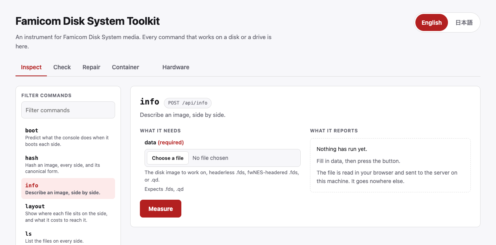
</picture>

#### `boot`

```bash
fdstoolkit boot <image> [--json]
```

What the BIOS does with each side: which file it loads, whether approval data is present, and the error number it would display.

<picture>
<source media="(prefers-color-scheme: dark)" srcset="assets/screenshots/boot-dark.png">
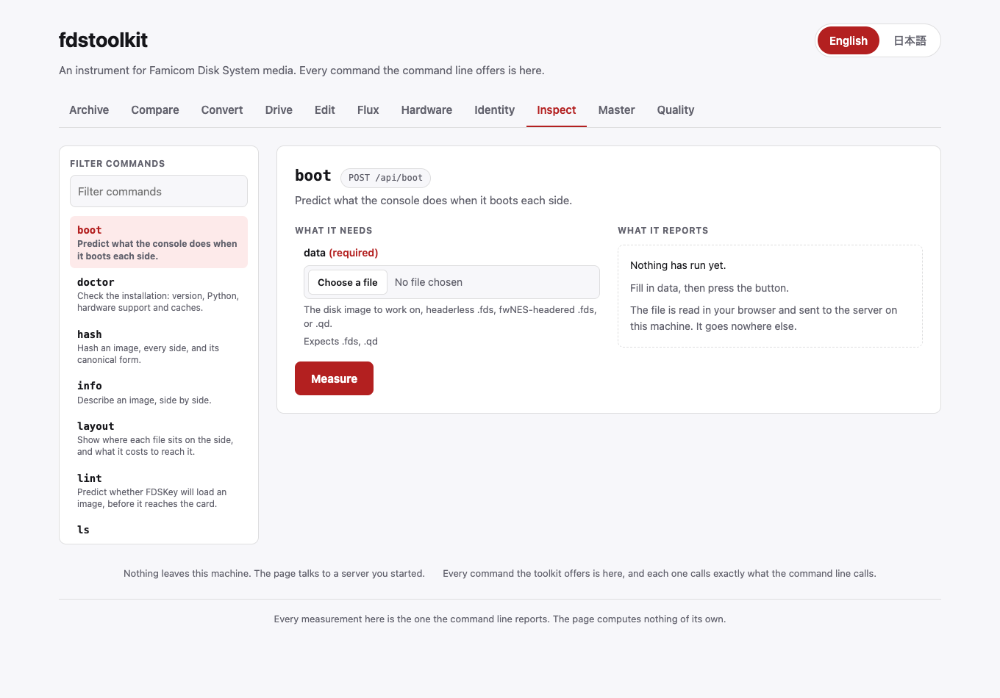
</picture>

#### `hash`

```bash
fdstoolkit hash <image> [--profile <name>] [-o <out>] [--force] [--json]
```

CRC32, MD5, SHA-1 and SHA-256 of the whole image and of each side, plus the canonical digest and the RetroAchievements MD5. The canonical digest ignores what changes on its own, such as the rewrite date and count, so two copies of one game match after a kiosk rewrote either; `--profile` picks how much it ignores. `-o` also writes the canonical image, the disk with those fields set to fixed values.

<picture>
<source media="(prefers-color-scheme: dark)" srcset="assets/screenshots/hash-dark.png">
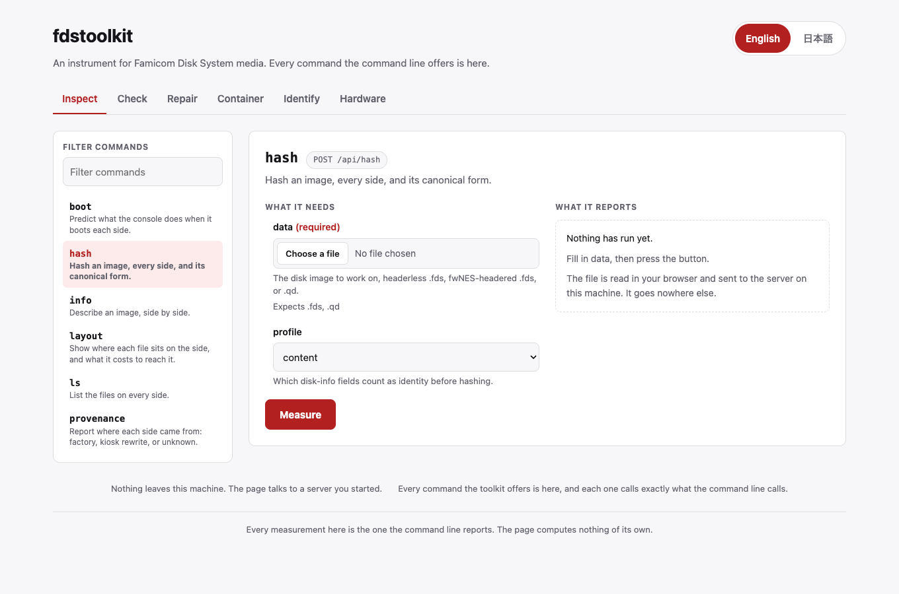
</picture>

#### `provenance`

```bash
fdstoolkit provenance <image> [--json]
```

Factory, kiosk rewrite, or unknown, per side, with the dates, serial and rewrite count behind the verdict. A factory disk carries serial `ffff` and rewrite count `00`.

<picture>
<source media="(prefers-color-scheme: dark)" srcset="assets/screenshots/provenance-dark.png">
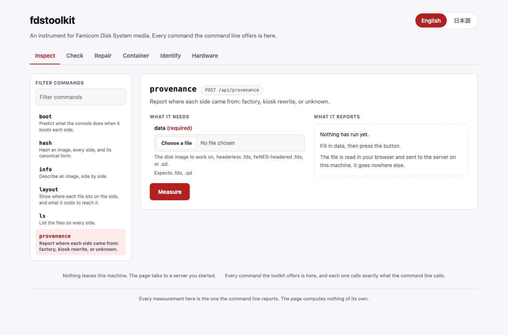
</picture>

### Check

A checksum answers one bit about a 65,500-byte side. These answer more.

#### `verify`

```bash
fdstoolkit verify <image> [--strict] [--json]
```

Structural and checksum findings, each with a code. `--strict` fails on warnings as well as errors.

<picture>
<source media="(prefers-color-scheme: dark)" srcset="assets/screenshots/verify-dark.png">
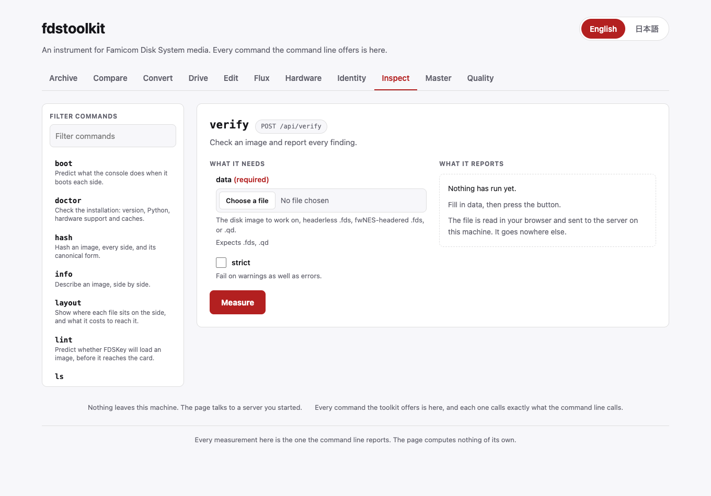
</picture>

#### `grade`

```bash
fdstoolkit grade <image> [--read <r>...] [--captures <bundle>] [--map] [--json]
```

A grade with the measurement behind it. `--read` folds in repeated dumps, `--captures` counts the weak blocks a saved capture bundle shows, and `--map` prints the per-block confidence and the basis for each. A single weak block holds the grade at marginal, since a block whose pulses move between reads is the one that fails next.

```bash
fdstoolkit grade disk.fds --read pass2.fds
```

```
clean, confidence 0.97
  ok   errors 0 within 0
  ok   confidence 0.97 within 0.6
  ok   read stability 1 within 1
```

Confidence starts from the checksum state and is adjusted by read agreement. A container that stores no checksums is treated as unproven rather than suspect, which is why a headerless `.fds` does not grade as unstable.

<picture>
<source media="(prefers-color-scheme: dark)" srcset="assets/screenshots/grade-dark.png">
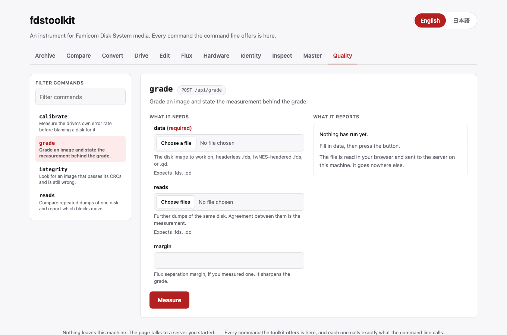
</picture>

#### `reads`

```bash
fdstoolkit reads <images>... [--json]
fdstoolkit reads --captures <bundle> [--json]
```

Compares repeated dumps of one physical disk block by block. Reports stability, which blocks move, and the direction of the bit flips. Magnetic decay loses transitions, so ones fall to zeros; the report names that as `loss`, the opposite as `gain`, and both as `mixed`.

With `--captures`, the same question is asked one layer down. Dumps can only disagree once a block has already failed its checksum; saved captures show the pulses that move between reads while every block still reads clean. Each weak block is listed with how many of its pulses differ, how many were invalid, and how many reads lost it altogether, the blocks some read never found first.

```bash
fdstoolkit reads --captures captures/
```

```
saved reads   3
weak blocks   1
side 0 block 3 (file data): 1 pulse(s) differ across 3 read(s), 0 invalid
```

```bash
fdstoolkit reads pass1.fds pass2.fds pass3.fds
```

```
passes        3
stability     99.88%
decay         loss
bits lost     14
bits gained   0
```

<picture>
<source media="(prefers-color-scheme: dark)" srcset="assets/screenshots/reads-dark.png">
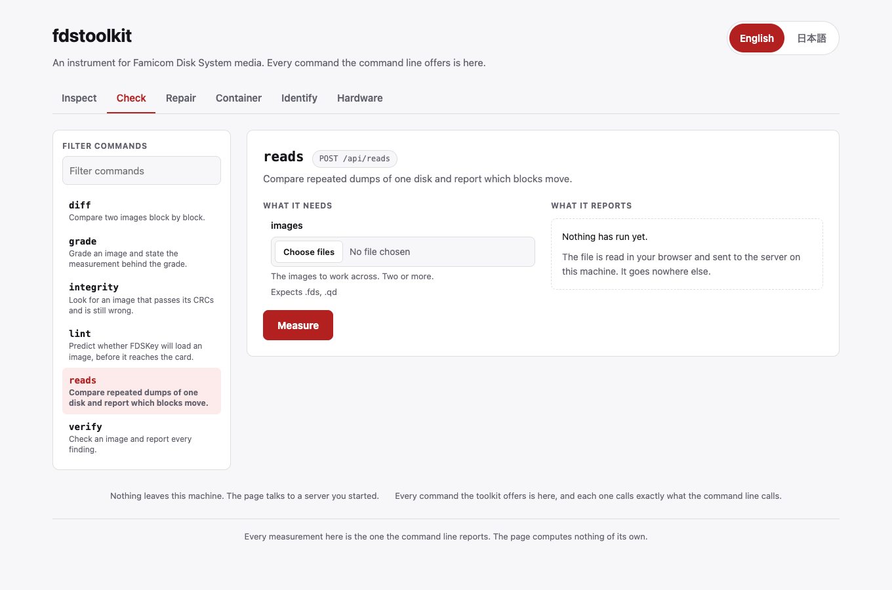
</picture>

#### `diff`

```bash
fdstoolkit diff <a> <b> [--explain] [--json]
```

Which blocks differ. `--explain` names the disk-info fields and the files instead of block indices.

<picture>
<source media="(prefers-color-scheme: dark)" srcset="assets/screenshots/diff-dark.png">
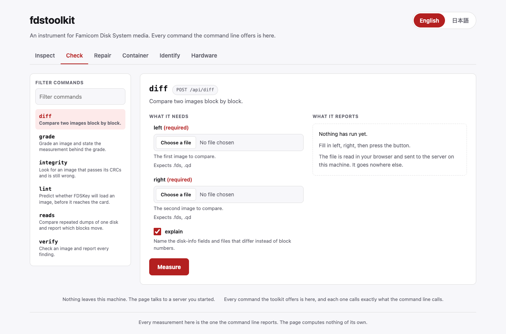
</picture>

### Repair

#### `rebuild`

```bash
fdstoolkit rebuild <image> -o <out> [--keep-tail] [--reveal-hidden] [--drop-hidden] [--renumber] [--force]
```

Re-emit from the parsed model: recompute checksums, correct declared sizes, drop trailing data. Hidden files are kept by default; `--reveal-hidden` raises the declared count to match, `--drop-hidden` removes them.

<picture>
<source media="(prefers-color-scheme: dark)" srcset="assets/screenshots/rebuild-dark.png">
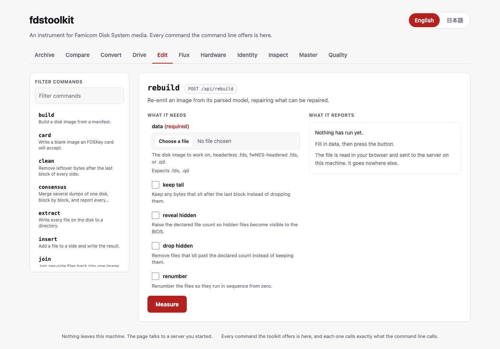
</picture>

#### `set`

```bash
fdstoolkit set <image> --set field=value... -o <out> [--side N] [--force]
```

Change disk information fields. Repeatable. Field names are the ones `info --json` prints.

<picture>
<source media="(prefers-color-scheme: dark)" srcset="assets/screenshots/set-dark.png">
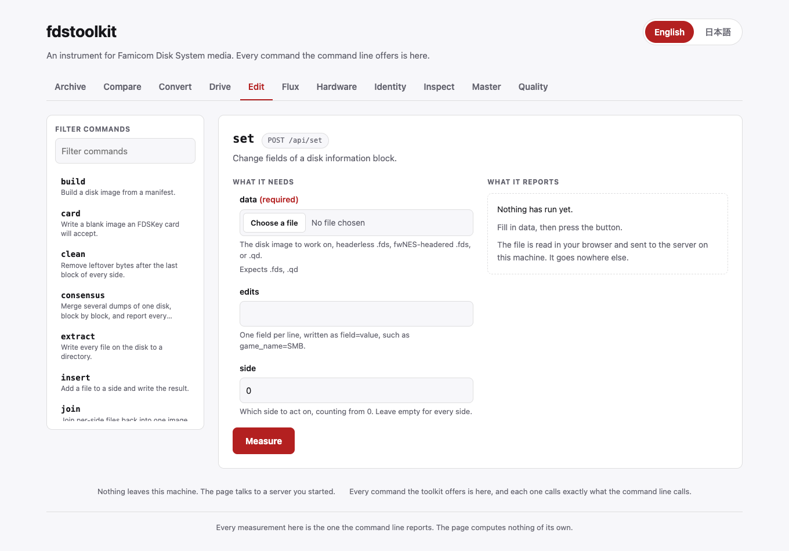
</picture>

#### `insert`

```bash
fdstoolkit insert <image> --file <f> --name <n> -o <out> [--address <hex>] [--kind program|character|nametable] [--side N] [--force]
```

Adds a file and raises the declared count. `--address` defaults to `6000`.

<picture>
<source media="(prefers-color-scheme: dark)" srcset="assets/screenshots/insert-dark.png">
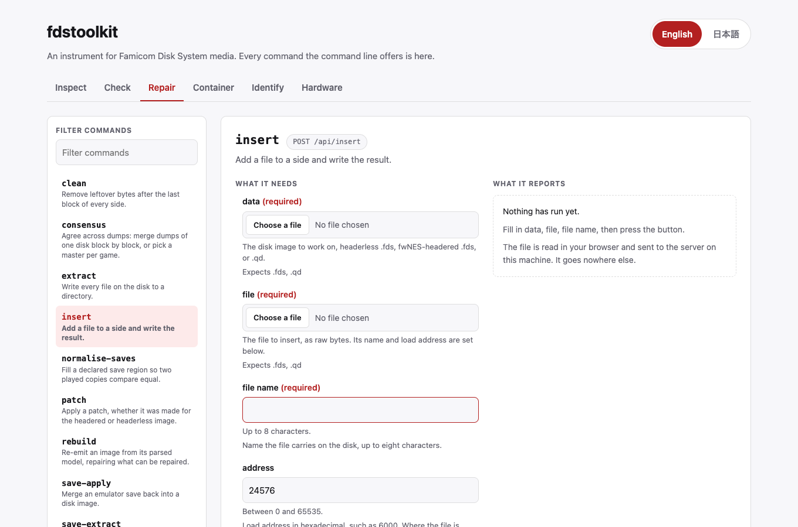
</picture>

#### `extract`

```bash
fdstoolkit extract <image> -d <dir> [--force]
```

Every file to disk, including files past the declared count.

<picture>
<source media="(prefers-color-scheme: dark)" srcset="assets/screenshots/extract-dark.png">
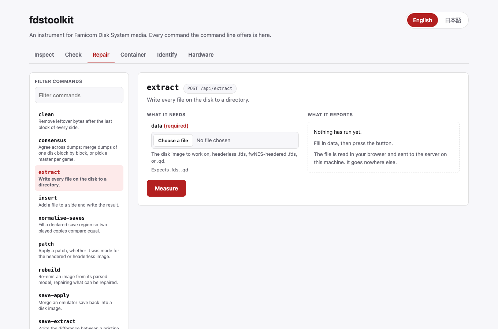
</picture>

#### `patch`

```bash
fdstoolkit patch <image> --patch <p> -o <out> [--force]
```

Apply IPS, UPS or BPS, whether the patch was made against the headered or headerless image.

<picture>
<source media="(prefers-color-scheme: dark)" srcset="assets/screenshots/patch-dark.png">
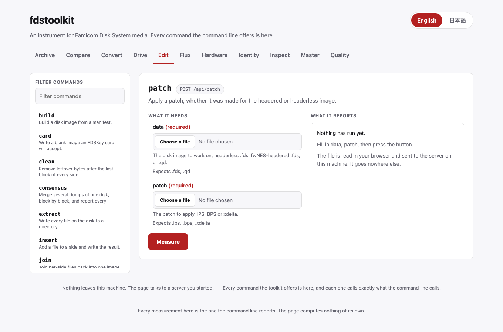
</picture>

#### `splice`

```bash
fdstoolkit splice <image> --donor <d>... -o <out> [--force]
```

Replace blocks whose CRC fails with the same block from a donor dump that has it good. Reports each substitution and every block no donor could supply. Exits 1 if anything is left unrepaired.

<picture>
<source media="(prefers-color-scheme: dark)" srcset="assets/screenshots/splice-dark.png">
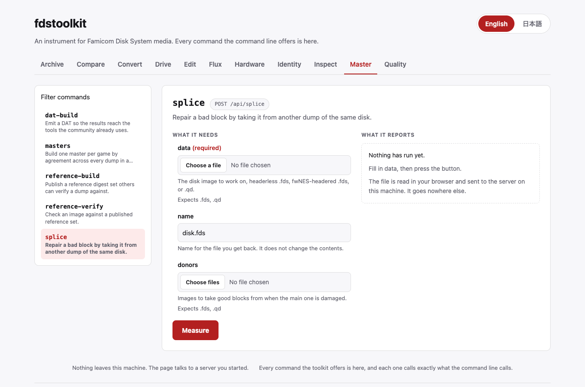
</picture>

#### `consensus`

```bash
fdstoolkit consensus <dumps>... -o <out> [--captures <bundle>] [--map] [--json] [--force]
fdstoolkit consensus --captures <bundle> -o <out> [--json] [--force]
```

Merges several dumps of one disk block by block, by majority, into one image, and reports every block the dumps disagree on. `--map` prints the per-block agreement.

`--captures` rebuilds a disk from a saved capture bundle by a pulse vote: for every block no read got right, the pulses of each read that reached it are compared one by one and the majority is kept. It needs three reads of the block, and a block every read got wrong in the same place stays wrong, because a vote cannot outvote a shared error. Alone, the rebuilt disk is the output and every block it could not fix is named. With dumps, the rebuilt disk joins them as one more voter.

<picture>
<source media="(prefers-color-scheme: dark)" srcset="assets/screenshots/consensus-dark.png">
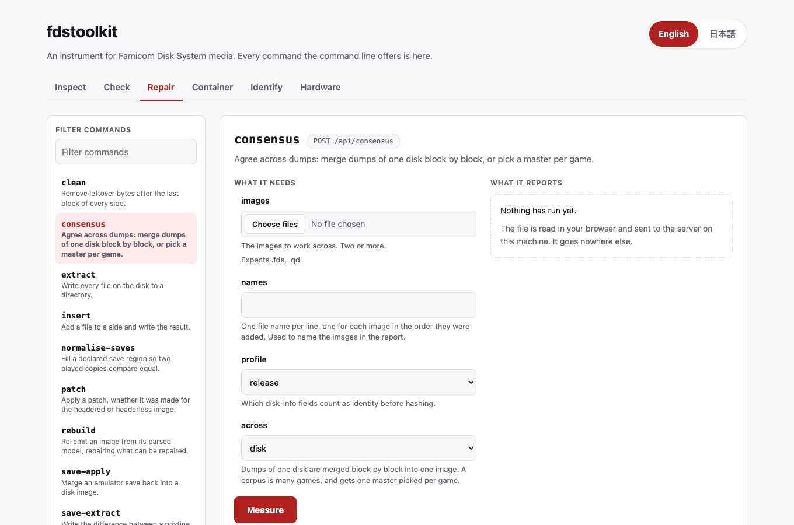
</picture>

#### `save`

```bash
fdstoolkit save find <dumps>... [--json]
fdstoolkit save apply <image> --save <s> -o <out> [--force]
fdstoolkit save extract <image> --played <p> -o <out> [--format ips|ups|image] [--force]
fdstoolkit save blank <image> --recipes <r> -o <out> [--force]
```

Everything about the file a game writes its progress to, in four actions:

| Action | Does |
|---|---|
| `find` | Compares dumps of one release and names the file that differs, which is the save |
| `apply` | Merges an IPS, UPS, BPS or whole-image save back into the image |
| `extract` | Writes the difference between a pristine disk and a played one as a save |
| `blank` | Fills the declared save region so two played copies compare equal. `--recipes` names the file declaring which region is the save, and is required: the toolkit will not guess which bytes a game writes |

Each action checks for what it needs and says what is missing: `apply` needs `--save`, `extract` needs `--played`, `blank` needs `--recipes`, and all three but `find` write a file, so they need `-o`.

<picture>
<source media="(prefers-color-scheme: dark)" srcset="assets/screenshots/save-dark.png">
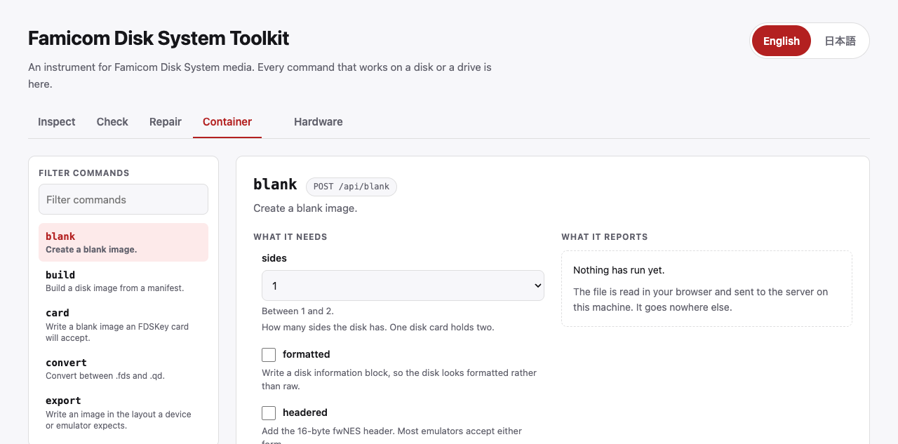
</picture>

### Container

#### `convert`

```bash
fdstoolkit convert <image> -o <out> [--header|--no-header] [--crc-mode preserve|compute|null] [--force]
```

Between `.fds` and `.qd`. `--crc-mode` decides what goes in the CRC fields when writing `.qd`: keep what the source had, recompute, or zero them. `preserve` is the default because a round trip that recomputes silently repairs corruption you may be trying to study.

<picture>
<source media="(prefers-color-scheme: dark)" srcset="assets/screenshots/convert-dark.png">
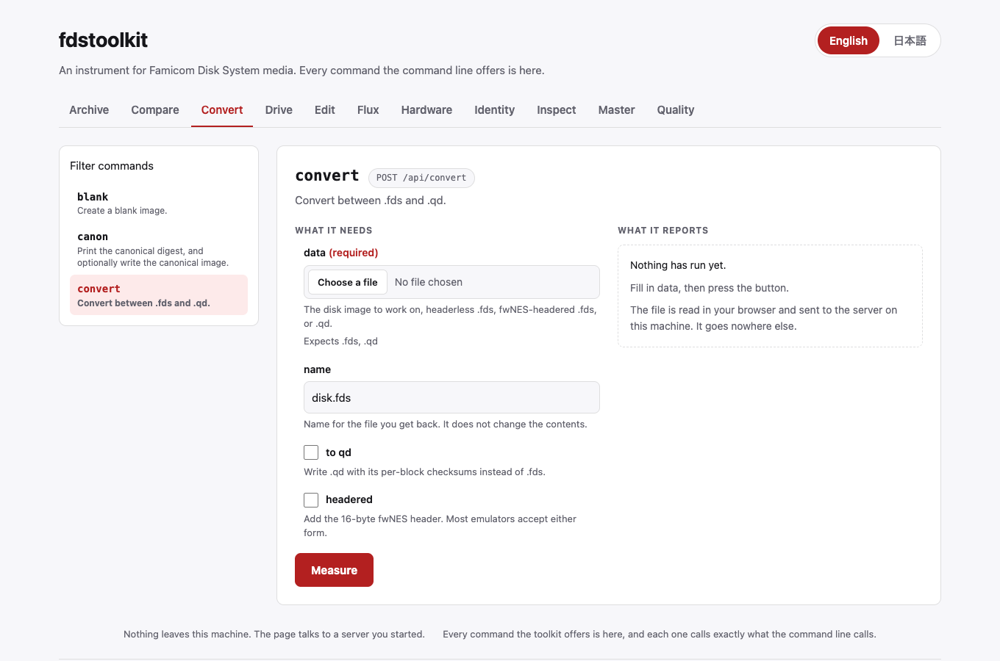
</picture>

#### `export`

```bash
fdstoolkit export <image> --target <t> -d <dir> [--force]
```

The directory layout a device or emulator expects. Targets: `nt-mini`, `mister`, `everdrive-n8-pro`, `mesen2`, `fceux`. Each writes a headerless `.fds`.

<picture>
<source media="(prefers-color-scheme: dark)" srcset="assets/screenshots/export-dark.png">
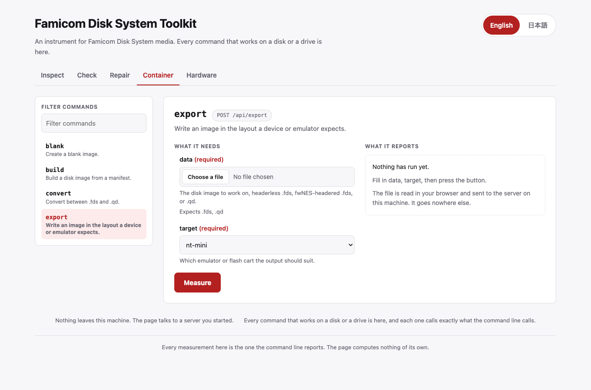
</picture>

#### `blank`

```bash
fdstoolkit blank -o <out> [--sides 1|2] [--formatted] [--header] [--game-name ABC] [--force]
fdstoolkit blank --calibration -o <out> [--header] [--force]
```

A blank image. `--formatted` writes a disk information block using values measured from 1,729 never-rewritten sides: country `49`, serial `ffff`, rewrite count `00`, filler `ff`.

`--calibration` makes the calibration disk instead: two sides built so that every pulse on them is known in advance, which `calibrate` recognises by itself. Each side carries six files in the order long, medium, mixed, long, medium, mixed, so every pattern sits both near the start of the side and near its end.

| File | Bytes | What it puts on the disk |
|---|---|---|
| `CAL-LNG` | `aa` repeated | 99.8 percent long pulses |
| `CAL-MED` | `24 49 92` repeated | 99.9 percent medium pulses |
| `CAL-MIX` | runs of 48 long bytes, 48 medium bytes and 16 `00` bytes | all three classes and the transitions between them |

The patterns follow from the toolkit's classification boundaries. A long pulse sits closer to the boundary below it than any other class sits to a neighbour, so a drive running fast shows first as long pulses read as medium. A medium pulse sits closest to the boundary above it, so a drive running slow shows first as medium pulses read as long. The stick's own hardware boundaries are not published, so this ordering is a property of the toolkit's decoder rather than a measurement of the stick.

Each side holds 53,854 bytes of blocks. That size is measured rather than taken from the format: the `.fds` file reserves 65,500 bytes a side, but among 345 factory-written sides the median carries 50,350 and the largest 54,958, with 95 percent at or under 53,910. Staying inside that keeps the last file on the physical side instead of past the end of the track.

```
wrote calibration.fds (131000 bytes)
write it only on a drive you trust, with write --calibration --trusted-drive, which lists every adjustment that drive needs first
```

<picture>
<source media="(prefers-color-scheme: dark)" srcset="assets/screenshots/blank-dark.png">
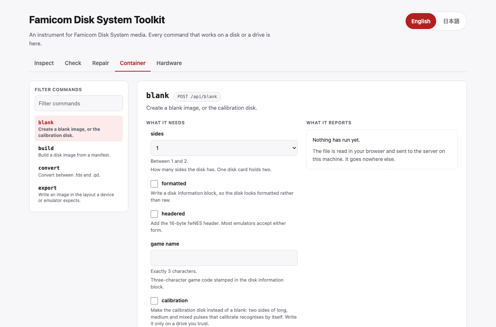
</picture>

#### `build`

```bash
fdstoolkit build <manifest> -o <out> [--force]
```

A disk built from a JSON manifest naming the disk fields and the files to place.

<picture>
<source media="(prefers-color-scheme: dark)" srcset="assets/screenshots/build-dark.png">
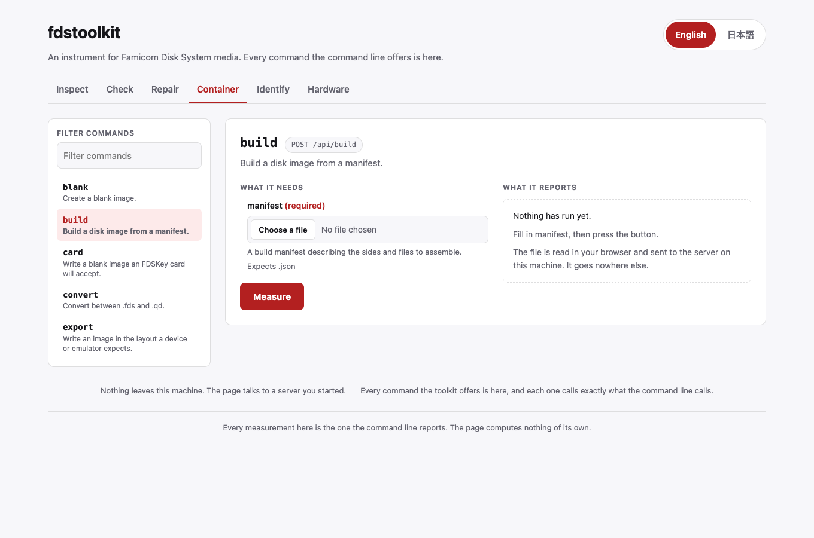
</picture>

### Hardware

#### `status`

```bash
fdstoolkit status [--json]
```

Whether an FDSStick is attached, what it reports about itself, and whether it opens, using the same checks as `doctor` and nothing else. It also says what the stick cannot tell you: nothing about the disk itself.

```
hardware support  hidapi is installed
fdsstick          none connected at 16D0:0AAA. Connect the FDSStick over USB before dumping or writing [warning]
the stick reports nothing about the disk itself: not whether one is inserted, whether it is write protected, or whether the battery holds
```

Exits 0 only when every check passes.

<picture>
<source media="(prefers-color-scheme: dark)" srcset="assets/screenshots/status-dark.png">
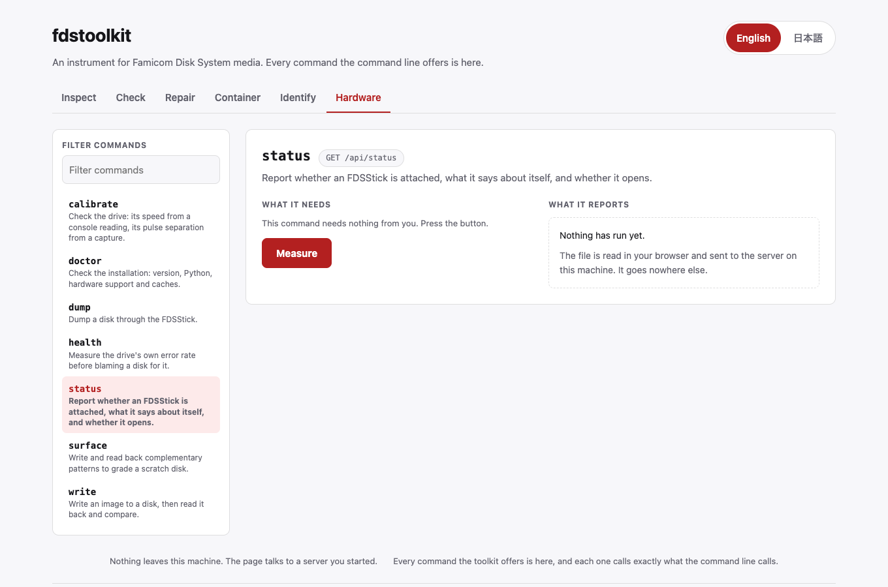
</picture>

#### `doctor`

```bash
fdstoolkit doctor [--json]
```

Version, Python, platform, whether hardware support is installed, which devices are attached and whether they open, and whether the codec and the identity profiles still pass their self-tests. Run this first when something behaves unexpectedly.


#### `dump`

```bash
fdstoolkit dump -o <out> [--sides N] [--passes N] [--retries N] [--raw <dir>] [--yes] [--force]
```

Read a disk into a `.fds` or `.qd` file, chosen by the output's suffix. A `.qd` keeps the checksum each block carried on the disk, so a block that never read clean stays visibly bad in it. `--passes` reads each side more than once, `--retries` re-reads a side that has failed blocks up to that many more times, and `--raw` keeps every pulse capture the drive returned as a bundle the other commands read back.

A block that failed on every read is not given up on. The captures of those reads go to the same pulse vote `consensus --captures` runs, and a block the vote rebuilds is written into the image, named on its own line, and leaves the grade at marginal rather than clean. A disk read once has a single capture per side, so the vote only has material after `--retries` or `--passes`.

The drive cannot read one block on its own, so every retry is a full read of the side. That is why the budget is per side rather than per block: each re-read resolves every block still failing, and a side with ten bad blocks costs at most `--retries` more reads, not ten times that. A re-read block is matched by its type and file number, never by position, so a damaged block that vanishes on the re-read cannot shift the ones after it. Blocks that only read clean on a re-read are counted as a sign the disk is wearing. A read that ends before the files the side declares counts as unfinished too, so it is re-read within the same budget, and a side that never reaches its declared files grades failed with the last block it reached.

The head sits under the disk and reads only the face turned down, toward it, so the drive cannot select a side. Every prompt names the side by its label, which faces up while the head reads that side from below. Reading more than one side asks you to turn the disk over between reads, and refuses rather than reading the same face twice. `--yes` answers that prompt. If the second read returns the same bytes as the first, the dump fails and writes nothing, because a disk that was not turned over produces a file that looks like a two-side dump and is not.

Every read and write runs against a deadline. Before anything has been measured a side gets 20 seconds; after the first side, the limit is three times as long as that side took, and never under 2 seconds. A side that overruns stops the command and closes the device, and is never retried, because a drive that has stalled once only wears the disk further. A dump that stalls writes no file. A write that stalls says the side may be half written, since only a fresh dump can show what landed. A side at the rate the adapter expects takes about 5.5 seconds. These limits come from that figure rather than from a measured drive, and are the first thing to revisit on real hardware.

<picture>
<source media="(prefers-color-scheme: dark)" srcset="assets/screenshots/dump-dark.png">
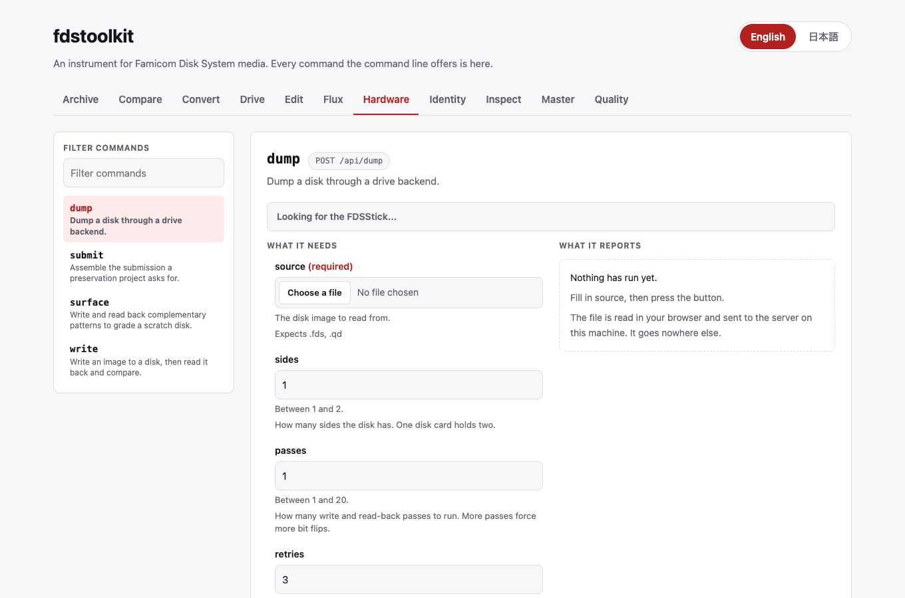
</picture>

#### `write`

```bash
fdstoolkit write <image> [--backup <p>] [--retries N] [--long-side] [--yes]
fdstoolkit write --calibration --trusted-drive [--backup <p>] [--retries N] [--yes]
```

Write a disk, read it back and compare. `--backup` saves the current contents first. Prompts unless `--yes`.

A side carrying more than 54,958 bytes of blocks, the longest of 345 factory sides measured, is refused before anything is written, because its last files may run past the end of the track. `--long-side` writes it anyway. The readback then fails if anything is left on the disk past the image, since a reader takes old blocks there for hidden files.

`--calibration` writes the calibration disk described under `blank`, both sides, turning the disk once. It is the one write that can do lasting harm with a disk that verifies perfectly: a drive out of adjustment writes a disk that reads back on it and on nothing else, and that disk would then teach every drive it calibrates the same error. So the command first prints what the drive must already have been through, and refuses unless `--trusted-drive` confirms it:

1. Clean the read head. Contamination reads as a media fault.
2. Put the spindle hub back at its factory position, set with a 1.5 mm hex screw. Misplaced, it gives errors 22 and 27.
3. Set the read head, published as its far edge 35.5 mm from the spindle centre with a tolerance of about 0.05 mm. Use `calibrate head --bracket` on a factory disk and settle in the middle of the range that reads.
4. Set the motor speed with `calibrate speed` on a factory disk until it reads clean.
5. Finish the speed on a console: Copy Master's speed test should show 5 with a disk in the drive, run twice. A strobe at the disk table shaft is the alternative.
6. Confirm on three factory disks, every side, several passes.
7. After writing, read the new disk on a second drive before trusting it.

Every step is one the `calibrate` section sources. None of them can be checked by the toolkit, which is why the confirmation is yours and not the command's.

An FDSStick does not report whether a disk is write protected, whether the battery holds, or whether a disk is even present, so the toolkit cannot check any of them before writing. What protects the disk instead is the sequence around the write. The side is read once before anything is written, and that one read is both the backup `--backup` saves and the baseline for the check afterwards. The command asks before it starts unless you pass `--yes`, and reads everything back afterwards to compare it with what was meant to be written. If the readback is identical to the read taken before, the disk did not take the write at all, and the command stops and says so rather than listing mismatched blocks.

A two-side image takes one turn of the disk. Side A is read, written and read back, then the command asks you to turn the disk over and does the same for side B. The first read of side B is also the check that the disk was turned: if it returns what was just written to side A, the head is still on side A, and the command stops before writing anything there. The backup is saved again after each side is read, so a write that stops on side B still leaves the original side A in the backup file.

```bash
fdstoolkit write game.fds --backup before.fds
```

```
overwrite the disk in the drive with 2 side(s) of new data, destroying whatever it holds now [y/N]: y
  reading side 0 before writing it
  writing side 0
  reading side 0 back
turn the disk over so the side B label faces up, then confirm. The head sits under the disk and reads side B from the face turned down, so this drive cannot select a side on its own [y/N]: y
  reading side 1 before writing it
  writing side 1
  reading side 1 back
verified True, grade clean
  verified on this drive only: a drive with misaligned heads writes disks that it reads back and other drives cannot, so read the disk on a second drive before trusting it
```

The lines indented by two spaces are progress, printed as each step starts, so a slow side is visible while it runs rather than only at the end.

<picture>
<source media="(prefers-color-scheme: dark)" srcset="assets/screenshots/write-dark.png">
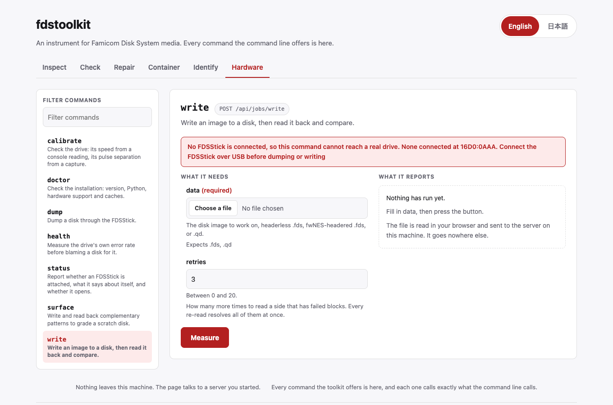
</picture>

#### `surface`

```bash
fdstoolkit surface [--sides N] [--passes N] [--quick] [--finish leave|blank|erase] [--backup <p>] [--yes]
```

Write and read back patterns that exercise every pulse the drive can record, to grade a scratch disk and tell a failing surface apart from a drive out of adjustment.

A disk stores flux transitions, and the data lives in the intervals between them. The adapter sorts every interval into one of three lengths, so a byte pattern only matters for the intervals it produces. Measured through the drive's own encoder, `0x00` and `0xFF` both write nothing but short intervals, and `0xAA` and `0x55` both write almost nothing but long ones. A pass built from those four bytes would write two classes twice and never write a medium interval at all.

One pass writes four patterns in sequence, each read back and compared before the next is written:

| Pattern | What it writes | What it exposes |
|---|---|---|
| unique data | Bytes from SHAKE-256 over a fresh 16-byte key per pass, different in every file and on every side | All three classes in realistic mixture, and any stale or misplaced block, which cannot match data that did not exist before this pass |
| short pulses | `00` repeated, 100 percent short intervals | The densest flux, the hardest for a weak head or a worn surface to resolve |
| medium pulses | `24 49 92` repeated, over 99.9 percent medium intervals | The class nearest its upper boundary, the first to fail on a slow drive |
| long pulses | `aa` repeated, over 99.9 percent long intervals | The class nearest its lower boundary, the first to fail on a fast drive |

A full side carries six files of 8,949 bytes, 53,854 bytes of blocks, the same as the calibration disk and for the same reason: among 345 factory-written sides the largest carries 54,958 bytes, and writing past that risks the last files falling off the end of the track, which would grade a good disk as damaged. The report states the fill as a share of that largest factory side. `--quick` writes a single 4 KiB file instead, for a fast check rather than a verdict.

`--passes N` repeats the whole four-pattern cycle with a new key each time. More passes is how a marginal spot is separated from a dead one, because a dead spot fails every time and a marginal one does not.

When a pass fails, the command compares the pulses the drive actually returned for that side against the intervals it wrote, and says which way the misreads lean. Misreads leaning one way across the failed blocks point at the drive's speed, since a fast drive reads long intervals as medium and a slow one reads medium as long. Misreads going both ways point at the surface. The thresholds are the ones `calibrate speed` uses, at least 16 misread pulses with three quarters of them leaning the same way.

The report classifies each failing block by how often it failed:

| Class | Meaning |
|---|---|
| hard | Failed on more than one pattern. The surface itself is gone at that spot |
| transient | Failed exactly once. Marginal rather than dead |
| recovered | Failed on an early pass and read clean on every later one. The rewrite reflowed the magnetisation |

The recovered count is the repair case. Rewriting a cell that had drifted toward the threshold
restores its margin, and a disk that starts with failures and ends clean has been refreshed rather
than merely measured. It is not a substitute for a dump: back the disk up with `--backup` first,
because every pass destroys what was there.

`--finish` decides what the disk is left holding when the test ends.

| Value | Leaves |
|---|---|
| `leave` | The last pattern written, long pulses. The default |
| `blank` | A factory-blank side: disk info block plus a file count of zero, byte-identical to what a kiosk-bought unwritten disk carries |
| `erase` | No blocks at all, so the adapter finds nothing to read |

`blank` is the useful one after a wipe. It produces the same bytes as
`blank --formatted`, which means the disk goes back into the drawer in the state it shipped in
and a writer will treat it as unwritten media.

The test stops as soon as its verdict is decided, because every further pass only wears a disk that is already failing:

- the first block that fails on two patterns stops it as damaged;
- a write the disk did not take stops it as not taking writes;
- a stalled drive stops it at once, like any other command.

A stopped test skips its `--finish`. A block that fails once does not stop anything, since one failure is the marginal case more passes are meant to separate.

With `--sides 2` every pass runs on side A, then the command asks you to turn the disk over once and runs every pass on side B. The finish then works backwards, side B first while its label still faces up, then one more turn for side A, so the whole test costs two turns. The check that the disk was really turned is the same one `write` makes.

```bash
fdstoolkit surface --sides 2 --passes 3 --backup before.fds --finish blank
```

```
a surface test destroys every byte on 2 side(s) of the disk in the drive. Use a scratch disk, never an original [y/N]: y
  side 0 pass 1 pattern unique data
  side 0 pass 1 pattern short pulses
  ...
  side 0 pass 3 pattern long pulses
turn the disk over so the side B label faces up, then confirm. The head sits under the disk and reads side B from the face turned down, so this drive cannot select a side on its own [y/N]: y
  side 1 pass 1 pattern unique data
  ...
  side 1 pass 3 pattern long pulses
  finishing side 1
turn the disk over so the side A label faces up, then confirm. The head sits under the disk and reads side A from the face turned down, so this drive cannot select a side on its own [y/N]: y
  finishing side 0
53854 data bytes per side, 98.0% of the most any measured factory side carries, 24 pattern pass(es) run
side 0 pass 1 pattern unique data: held
side 0 pass 1 pattern short pulses: held
...
side 1 pass 3 pattern long pulses: held
left the disk formatted as it leaves the kiosk, verified
grade clean
```

The same command on a disk with one bad spot on side A. It stops on the second pattern, before asking for a turn, because the verdict is already known:

```
  side 0 pass 1 pattern unique data
  side 0 pass 1 pattern short pulses
53854 data bytes per side, 98.0% of the most any measured factory side carries, 2 pattern pass(es) run
side 0 pass 1 pattern unique data: did not hold
side 0 pass 1 pattern short pulses: did not hold
in the blocks that failed, 23 read short and 19 read long: they go both ways, which is the surface rather than the drive's speed
1 block(s) failed on more than one pattern, which is the surface itself
stopped early: a block failed on two patterns, so the surface is damaged
grade failed
```

Exit status is 0 only when every pattern held and the finish verified.

<picture>
<source media="(prefers-color-scheme: dark)" srcset="assets/screenshots/surface-dark.png">
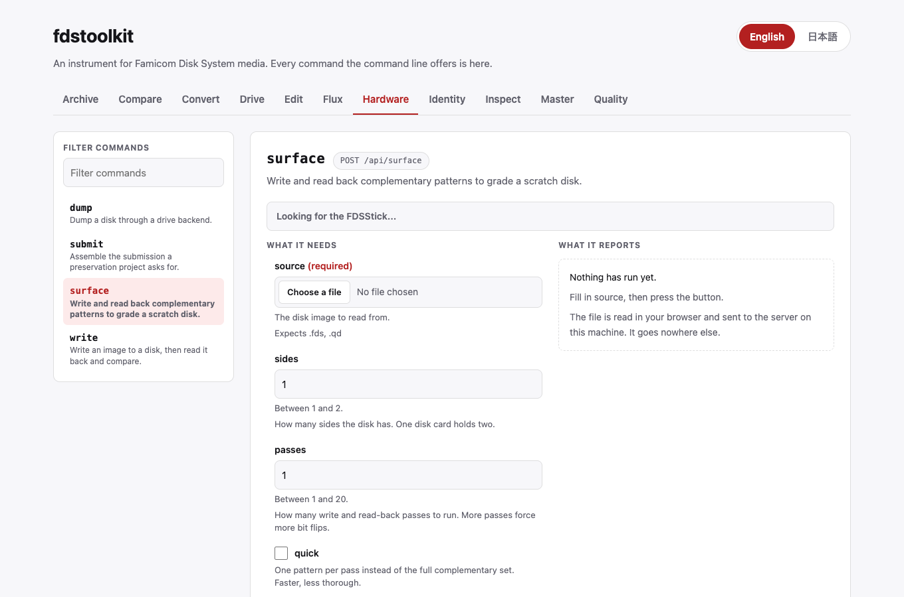
</picture>

#### `calibrate`

```bash
fdstoolkit calibrate speed|head [--reference <image>] [--side N] [--passes N] [--bracket] [--json]
fdstoolkit calibrate speed|head --captures <bundle> [--reference <image>] [--side N] [--json]
```

Reads the same side over and over while you adjust the drive, and says after every read what changed. It is meant to run while a screwdriver is in the drive: turn a little, watch the next line, turn again. `--passes` sets how many reads, 20 by default and 200 at most. Ctrl-C, or Stop on the page, ends it after the read in progress and reports what it saw.

`--captures` replays the reads a `dump --raw` kept instead of reading the drive, with no stick attached. Each saved read of `--side` becomes one line, so a dump that went badly can be read again later for what it says about the drive, and a bundle someone sends from another drive can be judged without that drive.

The disk in the drive must be one this drive did not write: a factory disk, or one written by a drive you trust. A drive out of adjustment writes disks that it reads back and no other drive does, so reading its own writes proves nothing. The command says so before the first read.

Every read is compared pulse by pulse against what the disk's content requires, and the command takes that content from the best source it has, in this order:

| Source | Where it comes from | What it can compare |
|---|---|---|
| `--reference` | An image of the same disk, dumped by a drive you trust or matched to a known dump | Every block, from the first read |
| The calibration disk | Recognised from its disk information and file headers, with no file needed | Every block, from the first read, including blocks that never read clean |
| Blocks read clean | Learned during the run: once a block passes its checksum, its bytes are known | That block, in every later read |

With none of them, only the checksums judge the first read, which says whether a block read and nothing about why not. Learning closes that gap quickly on a drive that is only slightly off, since most blocks read clean at least once, and not at all on a drive so far off that a block never reads clean, which is where the reference or the calibration disk earns its place. `--side` names which side of the reference is in the drive: the side whose label faces up, read from the face turned down.

```
this is the fdstoolkit calibration disk, side 0: every pulse is compared with what the disk holds, including blocks that never read clean
```

There are three adjustments in the drive, and this command covers what an FDSStick can see of each:

| Adjustment | Where | What `calibrate` watches |
|---|---|---|
| Motor speed | The potentiometer on the motor | `speed`: pulses read short or long against the reference |
| Spindle hub position, lost when the belt is replaced | The hub on top of the mechanism, fixed by a set screw | `head`: which blocks of the side read, and where the failures are |
| Read head alignment | The head adjustment screw | `head`: the same |

`speed` reports one of five readings for each read:

| Reading | Means |
|---|---|
| reads fast | Most misread pulses came back a class short. Lower the motor speed a little |
| reads slow | Most came back a class long. Raise the motor speed a little |
| errors with no speed bias | Blocks fail without leaning either way, which does not look like speed |
| nothing read | No block was found at all: far off speed, or the head or hub is out of position |
| reads clean | Every block read and every pulse matched |

A reading leans one way when at least 16 pulses were misread and at least three quarters of them went that way. Both figures were chosen by reasoning about what separates a speed error from noise, not measured on a drive, and they are the first to revisit with real hardware.

```bash
fdstoolkit calibrate speed --reference smb.fds --passes 3
```

```
judge the drive only with a disk it did not write: a factory disk, or one written by a drive you trust. A drive out of adjustment reads back its own writes, so those prove nothing
  read 1: 2 of 10 blocks, 116 pulses short, 0 long, 0 invalid, console error 27, block failed CRC: reads fast, first read
  read 2: 2 of 10 blocks, 116 pulses short, 0 long, 0 invalid, console error 27, block failed CRC: reads fast, the same as the last read
  read 3: 10 of 10 blocks, 0 pulses short, 0 long, 0 invalid: reads clean, better than the last read
reads clean: inside the tolerance the stick can see. It cannot see the last percent, so finish with a console speed test or a strobe at the disk table
```

The advice says whether to raise or lower the speed, never which way to turn the screw. One repair guide reports that turning counter-clockwise raises the speed; check it on your drive with a small turn before relying on it.

A clean `speed` reading means the drive sits inside the tolerance the RAM adapter accepts, not at the exact rate. For the last stretch, use a console-side test. Copy Master's speed test shows 1 to 9 and says "too slow" or "too fast"; ToToTEK and Bung recommend 5 with a disk in the drive, and running the test twice, because the first run starts with the head in an unknown position. A strobe app works too: the disk table shaft turns at 400 RPM.

`head` reports which blocks of the side read:

| Reading | Means |
|---|---|
| the start of the side is not read | The first blocks are missing and the rest read: the head starts in the wrong place |
| the end of the side is not read | The side reads until near its end: the head runs out of travel |
| errors across the side | Failures are spread out, which points at speed or at the disk rather than at position |
| nothing read | No block was found: the head or hub is far out of position, or the speed is |
| reads clean | The whole side read |

```bash
fdstoolkit calibrate head --reference smb.fds --passes 3
```

```
judge the drive only with a disk it did not write: a factory disk, or one written by a drive you trust. A drive out of adjustment reads back its own writes, so those prove nothing
  read 1: 6 of 10 blocks, blocks 0 to 3 not read, 0 pulses short, 0 long, 0 invalid, console error 22, block 1 expected: the start of the side is not read, first read
  read 2: 8 of 10 blocks, blocks 0 to 1 not read, 0 pulses short, 0 long, 0 invalid, console error 22, block 1 expected: the start of the side is not read, better than the last read
  read 3: 10 of 10 blocks, 0 pulses short, 0 long, 0 invalid: reads clean, better than the last read
reads clean: the whole side reads. Repeat with two more factory disks, since a head can be set to suit one disk and miss another
```

The head tolerance is about 0.05 mm, so adjust a quarter turn at a time and read again. Once it reads clean, repeat with two more factory disks: a head can be set to suit one disk and miss another. Neither mode can say which way to turn, only whether the last turn helped.

Each failing read also names the error a console would stop on for it, from the console's own table: `22` to `25` when block 1 to 4 is not found, `27` when a block is found and fails its checksum. These are the numbers the repair guides talk about, so a line reads the same way the television would. It is the stick's read translated, not a console's: a console reads with its own drive electronics, and could stop one block earlier or later.

`--bracket` runs the method the repair guides use to set the head: move it until the disk stops reading, move it back until it stops reading on the other side, then settle in the middle. Before every read after the first, the command asks for one small step, the same size each time, an eighth of a turn for the head screw. It turns you round when the disk stops reading, and when it stops on the other side too it says how wide the range that read was and how many steps back to its middle. That works only if every step is the same size, so count them.

```bash
fdstoolkit calibrate head --reference smb.fds --bracket --passes 60
```

The guides also publish the positions the parts should end up in. They come from people measuring their own drives, not from Nintendo, and the toolkit cannot check any of them:

| Part | Published value | Source |
|---|---|---|
| Read head | Its far edge 35.5 mm from the spindle centre, tolerance 0.05 mm | [TinkerDifferent, drive calibration](https://tinkerdifferent.com/resources/famicom-fds-drive-calibration-wip.52/updates) |
| Read head | 10.72 mm spacing, about 0.05 mm either way | [TinkerDifferent, calibration technique](https://tinkerdifferent.com/resources/famicom-disk-system-calibration-technique.39/) |
| Gear | The flange hole at the 8/9 or 9/10 tooth position | [TinkerDifferent, calibration technique](https://tinkerdifferent.com/resources/famicom-disk-system-calibration-technique.39/) |
| Spindle hub | Its factory position, set with a 1.5 mm hex screw; misplaced it gives errors 22 and 27 | [famicomdisksystem.com](https://www.famicomdisksystem.com/tutorials/fds-repair-mod/belt-replacement-adjustment/) |
| Speed | 400 RPM at the disk table shaft in one guide; 820 at the spindle and 1170 at the motor in another | Both TinkerDifferent guides above |

The two speed figures differ by about a factor of two, and neither guide says why or ties its figure to the bit rate the RAM adapter checks. Treat them as a starting point for a strobe, not a target this command can confirm.

Exit status is 0 when the last read was clean.

<picture>
<source media="(prefers-color-scheme: dark)" srcset="assets/screenshots/calibrate-dark.png">
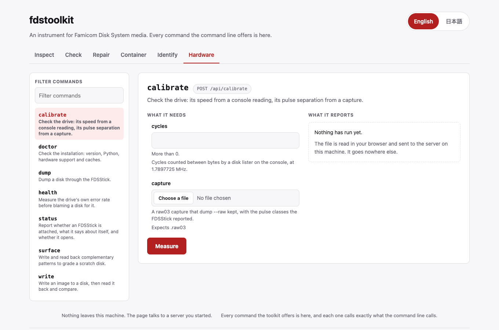
</picture>

#### `web`

```bash
fdstoolkit web [--host <h>] [--port N] [--no-open]
```

Open the local web interface. Every command above except `doctor` is reachable from it, and each route calls exactly what the command calls. `doctor` checks the installation, so it belongs in the terminal where the install happened. `--no-open` starts the server without opening a browser, which is what you want over SSH. Binds `127.0.0.1:8000` by default.

## Web interface

```bash
fdstoolkit web
```

`web` opens a browser on the page. `fdstoolkit web --no-open` starts the server without one, which is what you want over SSH. There is no headless-only command, because the toolkit drives hardware attached to this machine and is never a public service.

The page binds `127.0.0.1:8000` by default. It is not a service: nothing listens on a public interface unless you pass `--host`, and the page loads no remote resource, so no byte leaves the machine.

The rule the design turns on is that the web layer decides nothing. Every route parses its payload, calls the same function the command calls, and reports what came back. A grade requested through the page carries the same confidence and the same basis as `grade` prints, because it is the same call. That is checked rather than asserted: the tests compare a route's answer against the command's answer for the same input.

Saved captures travel the same way. A dump with `keep captures` set offers the bundle as a second download beside the image, and `consensus`, `reads`, `grade` and `calibrate` each take that zip in a `captures` field. A calibration that replays captures never opens the drive, so it runs with no stick attached.

| Route | Command it mirrors |
|---|---|
| `GET /api/catalogue` | the profile, format and target tables |
| `POST /api/info` | `info` |
| `POST /api/verify` | `verify` |
| `POST /api/hash` | `hash` |
| `POST /api/grade` | `grade` |
| `POST /api/reads` | `reads` |
| `GET /api/status` | `status` |
| `POST /api/blank` | `blank` |
| `POST /api/convert` | `convert` |
| `POST /api/jobs/dump` | `dump` |
| `POST /api/jobs/write` | `write` |
| `POST /api/jobs/surface` | `surface` |
| `POST /api/jobs/calibrate` | `calibrate` |
| `GET /api/jobs/current` | the disk job still running, if any |
| `GET /api/jobs/{id}` | one job's state, progress lines, prompt and result |
| `POST /api/jobs/{id}/answer` | the answer to a job's prompt |
| `POST /api/jobs/{id}/stop` | stop a calibration after the read in progress |

Images and captures travel base64 encoded in the request body. `GET /docs` serves the generated API reference, so the page is one client of the endpoints rather than the only one.

The choices the page offers come from `catalogue`, which is built over the enums. A profile added to the model appears in the page with no second edit.

`dump`, `write` and `surface` drive the FDSStick attached to this machine, and a side takes seconds, so they run as jobs rather than as one request. Starting one answers at once with a job id, and the page then polls the job and shows each progress line the command would print. Only one disk job runs at a time; a second answers 409 and names the job holding the drive. When no FDSStick is attached they also answer 409 and name the cause.

The page adds what a terminal gives for free:

- `write` and `surface` open a dialog that names what will be destroyed before anything starts. Focus lands on Cancel, so pressing Enter by reflex does not erase a disk. A request that skips the dialog is refused until it confirms the erase.
- When a job needs the disk turned over, the page shows the prompt with two buttons, The disk is turned over and Stop. An unanswered prompt is taken as no after 10 minutes, and the drive is released.
- Closing or reloading the tab while a job runs asks first, since closing it does not stop the drive. A page opened while a job is running picks that job up rather than starting a second one.
- `write` and `surface` offer the read taken before writing as `before.fds`, whatever the outcome.
- A job that stalls while writing says the side may be half written, as the command does.

The interface is in English and Japanese. Both dictionaries carry the same keys, and the test suite proves it rather than trusting it: every key the markup or the script references must exist in both, and no Japanese string may be left as English.

## Procedures

### Preserving a disk

One dump says what the drive read once. Two say whether it read the same thing twice.

```bash
fdstoolkit dump -o pass1.fds --passes 3 --raw captures/
fdstoolkit dump -o pass2.fds
fdstoolkit reads pass1.fds pass2.fds
fdstoolkit reads --captures captures/
fdstoolkit grade pass1.fds --read pass2.fds --captures captures/
```

Three passes give the bundle three reads of every side, which is what the weak-block map and the pulse vote need. If the two dumps disagree, `consensus` merges them by majority and names every block that did not settle, and `consensus pass1.fds pass2.fds --captures captures/` adds the pulse vote as one more voter. If one dump has a block another has good, `splice` takes it. Keep the bundle with the images: it is the only record of how the disk read, and it can be voted again later without the disk.

### Calibrating a drive, coarse then fine

1. Clean the head before anything else. Contamination reads as a media fault.
2. Take a factory disk, or a calibration disk written on a drive you trust. Never use a disk this drive wrote. An image of the factory disk sharpens the count, and without one `calibrate` learns each block from the reads that come back clean.
3. After a belt replacement, run `calibrate head` and adjust the spindle hub, then the head, a quarter turn at a time, until every read is clean.
4. Run `calibrate speed` and raise or lower the motor speed as it says until it reads clean.
5. Finish the speed with a console test or a strobe, since the stick cannot see the last percent.
6. Repeat `calibrate head` with two more factory disks. Then confirm with a disk known to be hard to read: community practice uses a specific side with 39 files, and a pass means all 39 with no checksum error.

### Deciding whether it is the drive or the disk

One disk cannot answer this. Read several and compare where they failed: a place that fails on every disk is the drive, failures confined to one disk are that disk, and a drive that stops answering is neither. In the last case the correct response is to stop, not to try another disk in it.

## Formats

A side is a sequence of blocks:

| Block | Code | Length | Contents |
|---|---|---|---|
| Disk information | `0x01` | 56 | Verification string, game code, dates, kiosk provenance |
| File amount | `0x02` | 2 | Declared file count |
| File header | `0x03` | 16 | Number, id, name, load address, size, kind |
| File data | `0x04` | 1 + size | The file |

| Container | Side size | Checksums | Notes |
|---|---|---|---|
| `.fds` headerless | 65500 | No | What No-Intro hashes |
| `.fds` with fwNES header | 16 + 65500 per side | No | Header carries the side count |
| `.qd` | 65536 | Yes | Virtual Console rips and Quick Disk dumps |
| Packed pulse classes, `raw03` | variable | Yes | Two bits per pulse, already quantised by the FDSStick |

What each conversion costs:

| From | To | Lost |
|---|---|---|
| `.fds` headered | `.fds` headerless | The declared side count |
| `.qd` | `.fds` | Every stored checksum |
| `.fds` | `.qd` | Nothing, but the checksums are synthesised |
| any | canonical | Everything the profile masks |

A file header's size is a claim, and some copy protections make it false: a header declaring one byte in front of a data block that really holds 48 KiB. Where checksums exist, in a pulse capture or a `.qd`, the data block is read to the point where its own checksum matches and the next block or the gap begins, and `FDS016` names the difference. A `.fds` has no checksums to find that point, so it keeps the bytes but not the boundary.

## Exit codes and scripting

`0` means nothing failed, `1` means something did. What counts as failure is command-specific and documented above: an unrepaired block for `splice`, a block the dumps disagree on for `consensus`, a last read that was not clean for `calibrate`.

Every reporting command takes `--json`, and the JSON is the same data the human output renders. Standard output carries only the result; progress lines, notices and questions to the operator go to standard error, so a pipe into `jq` sees nothing else. Commands that write files refuse to overwrite without `--force`.

```bash
fdstoolkit verify disk.fds --json | jq -r '.findings[] | "\(.code) \(.message)"'
fdstoolkit consensus a.fds b.fds c.fds -o merged.fds --json | jq '.disagreements'
fdstoolkit calibrate speed --reference smb.fds --passes 5 --json | jq -r '.headline'
```

## What this cannot do

**No FDS flux capture exists.** Quick Disk is one continuous spiral with no index hole and no standard stepping, so KryoFlux and Greaseweazle cannot read this medium at all. This toolkit reads only what an FDSStick produces.

**An FDSStick cannot measure the last percent of drive speed.** The device rounds every pulse to one of three lengths in hardware and sends classes, not timing, so a small speed error changes no class. `calibrate speed` finds a drive outside the tolerance; a console test or a strobe finishes the job.

**Fine head alignment is not measurable from pulse classes.** It needs signal amplitude. `calibrate head` sees only whether blocks read, so it finds a head or hub that is out of position, not one that is merely off-centre.

**Belt and motor faults are not separable** without the pulley ratio, which no trustworthy source states.

## Contributing

Development setup, the test suite and the release process are in [CONTRIBUTING.md](CONTRIBUTING.md).

## Licence

MIT. See [LICENSE](LICENSE).

---

<div align="center">

Famicom Disk System / ファミコン ディスクシステム / ディスクカード preservation, dumping
(吸い出し), disk quality measurement, drive calibration (ドライブ調整), belt replacement
(ベルト交換), FDSStick.

Japanese documentation: <a href="README.ja.md">README.ja.md</a>

</div>
